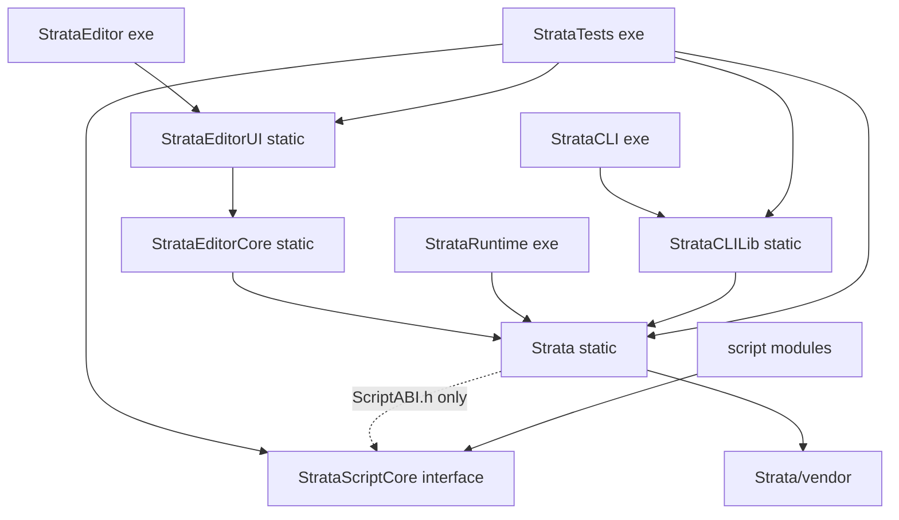

# Strata architecture

How the engine, the editor, the runtime and the tools fit together, for an engineer joining the project. Rules and
conventions (code style, testing, the review checklist) are in [AGENTS.md](../AGENTS.md) and are not repeated here;
task playbooks are the skills in [.claude/skills/](../.claude/skills/). Every section names the code it describes:
when that code changes, update this file in the same commit (AGENTS.md, review checklist item 5).

Paths are relative to the repository root. Engine modules live in `Strata/src/Strata/<Module>/`, so `Scene/Scene.h`
means `Strata/src/Strata/Scene/Scene.h`.

1. [Targets and dependencies](#targets-and-dependencies)
2. [Engine modules](#engine-modules)
3. [Application and frame loop](#application-and-frame-loop)
4. [Scene runtime lifecycle](#scene-runtime-lifecycle)
5. [Threading model](#threading-model)
6. [Asset pipeline](#asset-pipeline)
7. [Streaming and residency](#streaming-and-residency)
8. [Scripting](#scripting)
9. [Editor](#editor)
10. [Export and the runtime](#export-and-the-runtime)

## Targets and dependencies

The root `CMakeLists.txt` adds `Strata/vendor`, `StrataScriptCore` and `Strata`, then the optional targets
(`STRATA_BUILD_EDITOR`, `STRATA_BUILD_RUNTIME`, `STRATA_BUILD_CLI`, `STRATA_BUILD_TESTS`). An arrow means "links".



Each target is defined in the `CMakeLists.txt` of its directory; script modules by `strata_add_script_module()` in
`StrataScriptCore/CMake/StrataScriptModule.cmake`. The brand assets (the strata mark as PNGs, raw RGBA and `.ico`, in
`StrataEditor/Resources/Brand/`) are drawn by `Tools/GenerateBrandAssets.py` and committed; `Core/Version.h` (from
`Version.h.in`) carries the version and, through `Core/VersionCommit.h`, the git commit of the build (`c_EngineCommit`),
which the `StrataVersionCommit` target reads at every build (`CMake/StrataVersionCommit.cmake`; the header changes only
when the commit does).

| Target | Kind | What it is |
| --- | --- | --- |
| `Strata` | static library | Engine modules, platform code, embedded shaders and default font (`Strata/src/`). |
| `StrataScriptCore` | interface library | Script C ABI and header-only C++ SDK; links glm only (`StrataScriptCore/`). |
| `StrataEditorCore` | static library | The editor without UI (`StrataEditor/src/Editor/`). |
| `StrataEditorUI` | static library | The ImGui interface on the core: `EditorLayer`, panels, widget kit, theme, embedded fonts; links `nfd` (`StrataEditor/src/UI/`, `Panels/`, `EditorLayer.*`). |
| `StrataEditor` | executable | Runs the UI: `EditorApplication` (options, theme and fonts, `EditorHost`) (`StrataEditor/src/EditorApplication.cpp`). Embeds the window icon (`EditorIcon.h`); on Windows `StrataEditor.rc.in` adds the `.ico` and version information. |
| `StrataRuntime` | executable | Plays exported games (`StrataRuntime/src/RuntimeApplication.cpp`); on Windows `StrataRuntime.rc.in` gives it (and every exported game) the `.ico`. |
| `StrataCLILib`, `StrataCLI` | static library, executable | Automation client and MCP server (`StrataCLI/src/`). |
| `StrataTests` | executable | doctest suites; builds the test script modules as dependencies (`StrataTests/`). |
| script modules | `MODULE` libraries | Game code: the tests' modules and every game project's `Scripts/`. |

CTest runs the `StrataTests` suites in groups selected by suite name (`StrataTests/CMakeLists.txt`; the groups and
labels are listed in AGENTS.md, "Testing"). The perf lab is one of them: suites `Perf.*` and `PerfGPU.*`
(`StrataTests/src/Perf/`) measure metrics against the budgets in `StrataTests/Perf/Budgets.json`, in Release and Dist
only, and write `<build>/PerfResults/<config>.json`. `Perf.Scene` and `Perf.Scripting` measure scenes built by
`Perf/SceneGenerators.h` (flat roots, a nested tree, scripted entities); `Perf.Editor` (editor commands) and
`PerfGPU.Editor` (the real `StrataEditor`'s frame times on generated 100,000- and 1,000,000-entity scenes, read from
its `editor.wait` results) live in `src/Editor/`, which only builds with the editor.

What may depend on what:

- `Strata` knows nothing about the editor, the runtime executable, the CLI or the tests. It links `StrataScriptCore`
  privately and only for `StrataScript/ScriptABI.h`; it never includes the C++ SDK (comment in
  `Strata/CMakeLists.txt`). Its public dependencies are glm, EnTT, spdlog, nlohmann_json, NVRHI, Dear ImGui and
  ImGuizmo; Vulkan, GLFW, Jolt, miniaudio, stb, cgltf, MikkTSpace and meshoptimizer are private, so dependents do not
  see their headers.
- Script modules link `StrataScriptCore` only and never the engine; only two entry points are exported
  (`StrataScriptModule.cmake`). See [Scripting](#scripting).
- `StrataEditorCore` holds the editor's state and commands; `StrataEditorUI` only draws that state and calls the
  commands, and reaches the application only through `EditorHost` (`StrataEditor/src/EditorHost.h`), so tests link both
  and draw the UI without a window or GPU (`StrataTests/src/Editor/ImGuiHarness.h`).
- StrataCLI's logic lives in `StrataCLILib` so that `StrataTests` can link it (`STRATA_TESTS_HAVE_CLI`). Editor and
  CLI tests compile only when those targets exist (`StrataTests/CMakeLists.txt`).
- Platform code is in `Strata/src/Platform/` (`Windows`, `Posix`, `GLFW`, `Vulkan`), filtered per OS by
  `Strata/CMakeLists.txt`; engine modules reach it through interfaces such as `Core/Platform.h`, `Core/Window.h`,
  `Core/CrashGuard.h`, `Core/Process.h`, `Core/DynamicLibrary.h`, `Core/FileChangeNotifier.h` and
  `Renderer/GraphicsDevice.h`. Engine code outside `src/Platform/` includes no OS headers.

Applications built on `Application` (editor, runtime) get `main` from `Core/EntryPoint.h`, which calls the client's
`CreateApplication`, runs it and returns its exit code. `StrataCLI` has its own `main` and no `Application`.

## Engine modules

**Core** (`Core/`). `Application` owns the window, the graphics device, the layer stack and the main-thread queue
and runs the frame loop; `Layer`/`LayerStack` hold the client's behavior; `Window` is implemented by
`Platform/GLFW/GLFWWindow` (`SetIcon` takes RGBA images of several sizes; macOS and Wayland windows have no icon of
their own and ignore it). Services: `Log` (spdlog; `LogBuffer` backs the editor console and `log.read`), `Assert`,
`JobSystem`, `FileSystem` (UTF-8 paths), `FileWatcher`, `FileLock`, `Platform` (OS services, private directories,
process memory with peaks: `GetProcessMemory`, process uptime: `GetProcessUptime`),
`Process` (child processes), `DynamicLibrary`, `CrashGuard`, `UUID`, `Crypto` (SHA-256, peer authentication), `Base64`,
`CommandLine`, `Timer`/`FramePacer`, `JsonUtils` (exception-free JSON reads), `SequenceLock` (lock-free hand-off to the
audio thread) and `Profiling` (Tracy with `STRATA_ENABLE_TRACY`).

**Events** (`Events/`). Window, key and mouse events (`ApplicationEvent.h`, `KeyEvent.h`, `MouseEvent.h`, including
`WindowFileDropEvent` and `WindowContentScaleEvent`, raised when the window moves to a display with another DPI setting
or the setting changes) are dispatched synchronously: `Application::OnEvent` hands each one to the layers from the top
down until one marks it handled (`EventDispatcher`). An unhandled `WindowCloseEvent` ends the application, so a layer
can veto closing (the editor asks about unsaved changes).

**Input** (`Input/`). `Input` is a static polling API: down state, per-frame pressed/released transitions, mouse
position relative to the input viewport, deltas, scrolling and gamepads. `GLFWWindow` feeds it (`Input::Process*`);
Input reaches the window only through `InputWindow` (size, cursor mode), which `Window` implements, so the input layer
stays below the application shell. It also has a virtual device for tools (`SimulateKey` and friends) merged with the
real devices, `SetEnabled` (device input off, e.g. while the editor's game view has no focus) and `SetSuspended`
(input frames follow the game's updates). `InputNames` maps key and button names for the `input.*` commands.

**Math** (`Math/`). Engine conventions in `Math.h`: right-handed, +Y up, -Z forward, reversed-Z projections, Euler
angles in degrees. `AABB`, `Frustum`, `Ray`, and `Random` (thread-local generators).

**Reflection** (`Reflection/`). `PropertyType` (Bool to Entity), `PropertyInfo` (ranges, enum options, flags),
`PropertyBuilder`, `ComponentRegistry` (`ComponentInfo`: metadata plus type-erased ECS operations; components are
registered while the composition root runs and the registry is frozen afterwards, see
[Composition root and registries](#composition-root-and-registries)) and `PropertyJson` (canonical JSON plus lenient
parsing for automation). Reflection is the single description of component data: `SceneSerializer`, the inspector
(`StrataEditor/src/UI/PropertyWidgets.h`), the `component.*` commands, undo snapshots and script property access all
go through it, mostly via `Scene/ComponentAccess`.

**Scene** (`Scene/`). `Scene` owns the EnTT registry, the UUID map, the hierarchy and the cached world transforms,
and while it runs its scene systems (see [Scene runtime lifecycle](#scene-runtime-lifecycle)). `Entity` is a
non-owning handle. Components are plain structs in `Components.h`, registered with stable names in
`ComponentRegistration.cpp` (ID, Name, Transform, Relationship, Tag, Inactive, PrefabInstance, Camera, MeshRenderer,
DirectionalLight, PointLight, SpotLight, SkyLight, PostProcess, Text, RigidBody, BoxCollider, SphereCollider,
CapsuleCollider, MeshCollider, AudioSource, AudioListener, Script). `ComponentAccess` reads and writes them with
validation and change signals, `SceneSerializer` writes versioned JSON (keeping components it cannot read, see
[Composition root and registries](#composition-root-and-registries)), and `Prefab.h` defines the scene-shaped assets
(`EntityTemplate`, `Prefab`, `Model`, `SceneAsset`). See [Scene caches](#scene-caches) for how per-frame cost follows
what changed.

**Asset** (`Asset/`). `AssetManagerBase` (registry, asynchronous loading and residency), `AssetStreamingQueue` (the
order and admission of loads), `AssetResidency` (memory pools, budgets, `AssetPin`, eviction), `AssetManager` (the
process-wide active manager), `EditorAssetManager` (project files, `.meta` sidecars, imports, hot reload, pack
building), `RuntimeAssetManager` (reads an `AssetPack`), `AssetImporter` with the built-in importers
(`AssetImporters.cpp`, `GltfImporter`, `TextureImporter`), `AssetLoaderRegistry` (the loaders, registered by the
modules that own the types) and `BuiltinAssets` (fixed handles; the owning module provides each object through a
factory). The asset types are Scene, Prefab, Model, Mesh, Material, Texture, AudioClip and Font (`AssetTypes.h`). See
[Asset pipeline](#asset-pipeline) and [Streaming and residency](#streaming-and-residency).

**Renderer** (`Renderer/`). `GraphicsDevice` is the device interface (NVRHI on Vulkan, implemented in
`Platform/Vulkan/VulkanGraphicsDevice.cpp`; it owns the swapchain and frames in flight, 2 by default). `Renderer`
holds the process-wide services: the device, `ShaderLibrary` (SPIR-V compiled from `Strata/shaders` by glslang at
build time and embedded, `CMake/StrataShaders.cmake`), samplers, fallback textures, `BindlessTextureTable`,
`StagingTexturePool` (staging memory for texture uploads, reused) and the blocking `ReadTexture`. `SceneRenderer` draws
a scene (light clustering, shadow cascades, depth/normal/entity-ID prepass, GTAO, forward PBR, sky, transparents,
exposure, bloom, tone mapping, FXAA, then overlays and text). Its image-based lighting comes from the sky light's
environment map or its procedural sky (`IBL/ProceduralSky.comp` writes mip 0 of the environment cube, then the shared
filtering chain runs), computed again only when the source or the procedural parameters change; editor views can ask
for preview lighting and leave out screen-space text (`SceneRenderOptions`). Assets:
`Mesh`, `Material`, `Texture`, `Font`; procedural primitives come from `MeshFactory`. Also `TextRenderer`/`FontAtlas`,
`DebugDraw`/`SceneGizmos`, `TextureReadback` (non-blocking GPU readback) and `ImageWriter` (PNG). Conventions and
rules: AGENTS.md, "Architecture rules" and "Rendering".

**Physics** (`Physics/`). `PhysicsSystem` is the "Physics" scene system (Play and Simulate). `PhysicsWorld` builds a
Jolt world from RigidBody and collider components and steps it; `PhysicsRuntime` reference-counts Jolt's global
state; `PhysicsJobSystem` runs Jolt's jobs on the engine's worker pool; `PhysicsMeshShapes` cooks mesh collider shapes
on jobs and caches them process-wide; `AssetMeshProvider` supplies mesh data from the active asset manager.
`PhysicsTypes.h` has the settings, layers, `CollisionEvent` and `RaycastHit`. Collision events collected during a step
are dispatched afterwards on the main thread to listeners (`PhysicsSystem::AddCollisionListener`).

**Audio** (`Audio/`). `AudioEngine` wraps the miniaudio mixer, output device, listener and one-shots (main-thread
API; mixing runs on miniaudio's audio thread, or is pulled with `AdvanceNullDevice`/`ReadFrames` without a device).
`AudioClip` is immutable sound data, decompressed or streamed; `AudioClipAsset` is its asset, `AudioSource` a voice
with settings, and `AudioSystem` the "Audio" scene system (Play only). Details: AGENTS.md, "Audio".

**Scripting** (`Scripting/`). `ScriptEngine` (the loaded module, hot reload, faults, optional watchdog),
`ScriptModule` (loading, validation and guarded calls), `ScriptSystem` (the "Scripting" scene system: instances and
callbacks), `ScriptHostAPI` (the host function table), `ScriptValue` (ABI value conversions), `ScriptTypes`
(class, field and fault descriptions) and `ScriptWatchdog`. See [Scripting](#scripting).

**Project** (`Project/`). `Project` is a game project: the `.stproj` file, the asset directory, the script sources and
the intermediate directory `.strata/` (`Cache/`, `Scripts/Build/`, `Scripts/Bin/`), plus the process-wide active
project. `GameManifest` is the `.stgame` file of an exported game (name, asset pack, start scene, script module,
window settings).

**Runtime** (`Runtime/`). `GameRuntime` runs an exported game without depending on windowing or rendering: it opens
the pack, loads the script module, starts scenes and honors their requests. `GameRenderer` draws the running scene
from its primary camera, or a message frame that names the problem. See
[Export and the runtime](#export-and-the-runtime).

**Network** (`Network/`). `TcpSocket`/`TcpListener`/`SocketPoller` (`Socket.h`, implemented in
`Platform/Windows/WindowsSocket.cpp` and `Platform/Posix/PosixSocket.cpp`), `JsonRpc` (newline-delimited JSON-RPC
2.0), `RpcServer` (network thread, `RpcAuthentication` handshake, handlers on the main thread), `RpcClient`
(synchronous) and `EditorSession` (session files and discovery). Used by editor automation and StrataCLI; the
runtime does not use it. Protocol and security model: AGENTS.md, "Automation (editor RPC + MCP)".

**ImGui** (`ImGui/`). `ImGuiLayer` owns the Dear ImGui context; `Application` pushes it as an overlay when ImGui is
enabled and a window and graphics device exist, and calls `Begin`/`End` around the layers' `OnImGuiRender`. It styles
the UI for the window's content scale, on attach and on every `WindowContentScaleEvent`: the style is rebuilt from
ImGui's dark defaults by the application's style callback (`SetStyleCallback`; the editor installs its Bedrock theme) and
the fonts' DPI scale (`ImGuiStyle::FontScaleDpi`) follows; `SetContentScaleOverride` fixes the scale (`--ui-scale`).
`ImGuiRenderer` is the NVRHI backend (user textures are `nvrhi::ITexture*`). Only the editor enables it.

**Engine** (`Engine/`). `BuiltinModules`, the composition root (below), and nothing else: the only code that knows every
runtime module (tooling, the asset pipeline, is handed in by the programs that use it).

### Layers

The modules form a stack of layers, defined by path patterns in `StrataTests/Architecture/Layers.json` (the patterns
stand in for the library split of wave 4, so the rules apply before files move). A file may include files of its own
layer and of the layers it lists, which are always lower ones:

| Layer | Files (under `Strata/src`) | May include |
| --- | --- | --- |
| Core | `Core/**` except the application shell, `Math/**`, `stpch.h`, `Platform/Windows`, `Platform/Posix` (not the sockets) | nothing |
| Input | `Events/**`, `Input/**` | Core |
| App | `Core/Application.*`, `Layer.*`, `LayerStack.*`, `Window.h`, `EntryPoint.h`, `Platform/GLFW/**`, `Platform/Vulkan/VulkanLoader.*` | Core, Input |
| Asset | `Asset/**` except the pipeline files | Core |
| Reflection | `Reflection/**` | Core, Asset |
| Scene | `Scene/**` | Core, Asset, Reflection |
| Renderer | `Renderer/**`, `Platform/Vulkan/**` | Core, Input, App, Asset, Reflection, Scene |
| Physics, Audio | `Physics/**`, `Audio/**` | Core, Asset, Reflection, Scene |
| Scripting | `Scripting/**` | Core, Input, Asset, Reflection, Scene |
| Project | `Project/**` | Core, Asset, Reflection |
| Runtime | `Runtime/**` | Core, Input, App, Asset, Reflection, Scene, Renderer, Physics, Audio, Scripting, Project |
| Network | `Network/**`, `Platform/*/*Socket.cpp` | Core |
| ImGui | `ImGui/**` | Core, Input, App, Renderer |
| AssetPipeline | `Asset/EditorAssetManager.*`, `AssetImporter.*`, `AssetImporters.cpp`, `GltfImporter.*`, `TextureImporter.*` | Core, Asset, Reflection, Scene, Renderer, Audio |
| Engine | `Engine/**`, `Strata.h` | everything but AssetPipeline (shipped games link the composition root too; see below) |

`Architecture.Layering` (`StrataTests/src/Architecture/LayeringTests.cpp`, in `StrataTests.Core`) reads every C, C++ and
Objective-C(++) source and header under `Strata/src` (`STRATA_SOURCE_DIR`; `.h`, `.hpp`, `.inl`, `.c`, `.cpp`, `.m`, `.mm`,
so the macOS platform code too), parses its `#include`s, quoted and angle-bracketed (`Strata/src` is a public include
directory, so `<Strata/...>` reaches engine headers too; `LayeringAnalyzer`: comments, literals and `#if 0` blocks
skipped; resolved like the preprocessor, quoted includes next to the file first, both forms from `Strata/src`; standard
and third-party headers match no layer and are skipped), maps both ends to their
layers and fails on every file that is in no layer or in several, on every forbidden include that is not in
`StrataTests/Architecture/LayeringAllowlist.txt`, and on every allowlist line that matches nothing. Each allowlist line
names the include, the roadmap workstream that removes it and the reason; the list holds exactly `MaxAllowlistEntries`
lines (14: the application shell wiring services, asset uploads on the renderer, physics reading renderer meshes, and
scripting and audio calling the physics and audio systems), so it can only shrink.

### Composition root and registries

The engine is extended through registries rather than through code that knows its modules: `ComponentRegistry`
(components), `AssetLoaderRegistry` (stored bytes to asset objects), `AssetImporterRegistry` (source files to stored
bytes), `BuiltinAssets` (objects of the built-in assets) and `SceneSystemRegistry` (runtime systems of playing scenes).
`Engine::RegisterBuiltinModules` (`Engine/BuiltinModules.cpp`) fills them, once per process, before anything reads
them:

```text
open the registries (BeginRegistration; not the importers')
RegisterSceneModule        Scene/SceneRegistration.cpp         components (ComponentRegistration.cpp); Scene, Prefab, Model loaders
RegisterRendererModule     Renderer/RendererRegistration.cpp   Texture, Mesh, Material, Font loaders; built-in meshes and material
RegisterScriptingModule    Scripting/ScriptingRegistration.cpp "Scripting" system
RegisterPhysicsModule      Physics/PhysicsRegistration.cpp     "Physics" system
RegisterAudioModule        Audio/AudioRegistration.cpp         AudioClip loader, "Audio" system
options.AssetPipeline      RegisterAssetPipeline, Asset/AssetImporters.cpp: opens the importer registry, importers
options.Extra              registrations of games, tools and tests
ComponentRegistry::Freeze
```

- **Callers.** The `Application` constructor calls it first thing, without options, so every application is covered;
  a client that needs options calls it earlier. The editor does, in `CreateApplication`, to hand in the asset pipeline
  (`ModuleRegistrationOptions::AssetPipeline = RegisterAssetPipeline`); `StrataTests` does in `main`, before doctest
  runs and the helper modes start. StrataRuntime keeps the constructor's call: games read cooked packs, and since the
  composition root never names the importers (the Engine layer may not include AssetPipeline), the linker leaves them
  out of the runtime. A second call is a no-op (with an error when it carries an asset pipeline or `Extra`
  registrations, which would be lost).
- **Use before registration** fails `ST_CORE_VERIFY` with a message naming `Engine::RegisterBuiltinModules`, in every
  registry: a program that forgot the composition root stops at its first lookup instead of running without
  components or loaders. The importer registry stays closed in programs without the asset pipeline, so a game that
  reached for an importer stops there too.
- **Component lifecycle.** `ComponentRegistry` is closed, then open (`BeginRegistration`: `Register<T>` is valid from
  any registering code), then frozen (`Freeze`): the set of components never changes afterwards, so reads take no lock
  and are safe from any thread (asset loads deserialize scenes on workers). `Register<T>` after `Freeze`, for a type
  that is registered already or under a name that is taken (ignoring case), logs an error and returns a builder that
  converts to false and discards what it is given; nothing aborts. A game registers its components through
  `ModuleRegistrationOptions::Extra`.
- The loader, importer, built-in asset and scene system registries stay open: tools and tests register more later
  (a later loader or importer replaces or overrides the built-in one).
- **Components of modules a build lacks survive.** A scene, prefab or snapshot can name components this build does
  not register (a game module that is not loaded, a newer engine). `SceneSerializer::DeserializeEntities` keeps them
  verbatim in the runtime-only `UnknownComponentsComponent` (`Scene/UnknownComponents.h`; not registered, so the
  editor, reflection and the feature test never see it) and warns once per component name per load
  (`SceneAsset::CreateScene` logs its warnings); the writer puts them back next to the registered components, so a save
  writes them unchanged. `Scene::Copy` (play mode), prefab snapshots (`SerializeEntities`), `Scene::DuplicateEntity`
  and the editor's undo snapshots (`EntityState`, `Editor/SceneEdit.cpp`) carry them; restoring undo snapshots does not
  warn again (`EntityInstantiationOptions::ReportUnknownComponents`).

## Application and frame loop

Startup (`Application::Application`, `Core/Application.cpp`): `Engine::RegisterBuiltinModules` (a no-op when the client
registered the modules already), set the working directory, `JobSystem::Init`, create
the window unless headless, `Input::Reset`, create the graphics device, swapchain and `Renderer` when
`EnableRenderer` is set (no usable device: exit code 1), `AudioEngine::Init` (the null device when headless), and push
the `ImGuiLayer` overlay. The client's constructor then pushes its layer (`EditorLayer`, `RuntimeLayer`).

One frame (`Application::Run` and `RunFrame`):

```text
 1  ExecuteMainThreadQueue           functions queued with Application::SubmitToMainThread
 2  Input::BeginFrame                new input frame; queued simulated input applies
 3  Window::ProcessEvents            glfwPollEvents: Input::Process*, events through the layers
                                     window minimized: sleep 16 ms, frame skipped (not counted)
 4  GraphicsDevice::BeginFrame       cannot begin (e.g. mid-resize): sleep 16 ms, skipped; device lost: close
    Renderer::BeginFrame
 5  Layer::OnUpdate(timestep)        every layer in stack order: the editor's or the game's work, below
 6  AudioEngine::AdvanceNullDevice   only while mixing without an output device
    AudioEngine::Update              reclaims finished one-shots
 7  RenderImGui                      ImGuiLayer::Begin, every Layer::OnImGuiRender, ImGuiLayer::End
 8  back-buffer captures, GraphicsDevice::EndFrame (present)
    frame counted; MaxFrames (--frames) closes the application; the frame pacer waits (frame rate cap)
```

`Application::GetLastFrameWorkTime` is the CPU time of the last frame: steps 1 to 7 without the wait inside
`GraphicsDevice::BeginFrame` (for the GPU's earlier frames and the swapchain image), so it measures what a frame costs
whatever the display's refresh rate. The editor records it every frame (`EditorContext::RecordFrameTime`) and
`editor.wait` reports statistics of the frames it waited through (`frameTimes`), which is how command scripts and the
`PerfGPU.Editor` perf test measure editor frames.

The timestep is the wall time since the previous frame, clamped to `ApplicationSpecification::MaxTimestep` (0.25 s).
Windowed applications are paced by vsync when it is on (`WindowSpecification::VSync`) and by their frame rate cap;
headless ones by the cap alone, which the editor and the runtime set to 60 (`MaxFrameRate`,
`StrataEditor/src/EditorApplication.cpp`, `RuntimeApplication.cpp`). The cap is the application's `FramePacer`
(`Core/Timer.h`) and can change while it runs (`Application::SetMaxFrameRate`; setting the current rate keeps the frame
schedule): the editor lowers it while it is idle (see [Editor](#editor)). The pacer's wait comes after step 8, so
`Application::GetLastFrameWorkTime` leaves it out as well: a capped frame rate changes the rate, not the cost of a
frame. An exception escaping a frame (e.g. a lost device inside NVRHI) is logged and ends the loop.

The editor's layer update (`EditorLayer::OnUpdate`, `StrataEditor/src/EditorLayer.cpp`), after recording the previous
frame's work time:

1. `EditorContext::Update`: `ScriptEngine::Update` (hot reload), `ScriptBuilder::Update` (build processes),
   `EditorAssetManager::Update` (file changes, finished imports, load finalization, eviction), then either the running
   scene's `OnUpdateRuntime` followed by the script-fault check and the game's quit and scene-load requests, or the
   edited scene's `OnUpdateEditor`; then simulated input holds, input suspension, selection pruning and viewport picks.
2. `EditorCommandRunner::Update`: polls deferred commands.
3. `EditorAutomation::Update`: mirrors new commands as RPC methods, moves the session file with the project, and runs
   queued requests (`RpcServer::ProcessRequests`) through the runner.
4. The `--commands` script advances; quit, idle-timeout and last-frame checks run.

In step 7 the editor draws its shell and panels (`EditorLayer::OnImGuiRender`); the viewport panel renders the scene
there through `ViewportRenderer`. Last, idle throttling picks the frame rate cap for the next frames
(`EditorLayer::UpdateFrameRate`).

The runtime's layer update (`RuntimeLayer::OnUpdate`, `StrataRuntime/src/RuntimeApplication.cpp`):
`GameRuntime::Update` (asset finalization and eviction, `Scene::OnUpdateRuntime`, script-fault check, scene requests),
then the headless script-crash and quit checks, then `GameRenderer::Render` into the back buffer (windowed only) and the
`--screenshot` request on the last frame. The runtime has no ImGui.

Shutdown (`Application::~Application`): layers detach and are deleted top-down, the active asset manager and project
are released, the main-thread queue drains, `JobSystem::Shutdown` runs the queued jobs and joins the threads, then
audio, the renderer, the device and the window go.

## Scene runtime lifecycle

A `Scene` that plays owns scene systems (`Scene/SceneSystem.h`), created from `SceneSystemRegistry` in update order.
The built-ins (registered by their modules, see [Composition root and registries](#composition-root-and-registries))
are, in update order:

| System | Class | Modes | Order | Role |
| --- | --- | --- | --- | --- |
| Scripting | `ScriptSystem` | Play | | Script instances of the active `ScriptEngine` (null engine: no scripts). |
| Physics | `PhysicsSystem` | Play, Simulate | After Scripting | Jolt world; steps in `OnFixedUpdate`, then dispatches contacts. |
| Audio | `AudioSystem` | Play | After Physics | Sources and listener, in `OnLateUpdate` after scripts and physics. |

- **Update order.** A `SceneSystemDescriptor` names the systems it runs `After` and `Before`. The registry keeps the
  order of these constraints that follows registration order as far as they allow: the first registered system runs as
  early as the constraints allow, then the second, and so on (built from the back, placing the latest registered system
  whose successors are placed). A system thus moves ahead of earlier registered ones only when it has to run before a
  system that runs ahead of them, and a system no constraint involves runs after every system registered before it: a
  later "Wind" that runs `Before` Physics does not pull an unconstrained "CameraFollow" registered between them ahead of
  Physics. The order is recomputed on every `Register` and `Unregister` (`Scene/SceneSystem.cpp`).
  A constraint that names an unregistered system or the system itself, or that closes a cycle, makes `Register` return
  false with an error naming the systems (e.g. `TestA -> TestB -> TestA`) and leaves the registry unchanged; so does
  unregistering a system others name. Changes are refused while any scene runs (`Scene::GetRunningSceneCount`): the
  running scenes created their systems from the registry.
- **Lookup.** `MakeSceneSystemDescriptor<T>` records the class (`SceneSystemDescriptor::Type`); `OnRuntimeStart` maps
  it to the created system, so `Scene::GetSystem<T>` is a hash lookup of the exact class (null for a class that is not
  registered, not created in the current mode, or a base class).

```text
OnRuntimeStart(mode)   reset time, pause, steps and requests; create the systems the mode runs;
                       every OnRuntimeStart, then every OnRuntimeStarted (scripts' OnCreate: physics already runs)
OnUpdateRuntime(dt)    paused without steps: only world transforms
                       dt = timestep * time scale (one fixed step while stepping)
                       OnUpdate -> OnFixedUpdate x N (accumulator, at most MaxFixedStepsPerFrame = 8, backlog
                       dropped) -> OnLateUpdate -> flush deferred destruction -> world transforms
SetPaused(bool)        OnPausedChanged on every system; Step(n) runs n single fixed steps while paused
OnRuntimeStop()        OnRuntimeStop in reverse order, systems destroyed in reverse order, destruction flushed
```

- While systems run (`Scene::IsUpdating`), `DestroyEntity` is deferred to the end of the update; before an entity
  goes, every system gets `OnEntityDestroying` (descendants first), so scripts receive `OnDestroy` with the entity
  still valid (`Scene.cpp`). The deferred requests of an update are destroyed in one batch, like `DestroyEntities`.
- Systems react to edits through EnTT signals; `ComponentAccess` and `Entity::MarkModified` emit `on_update`.
- Debug builds end every `OnUpdateRuntime` and `OnUpdateEditor` by asserting that the scene's caches match a full
  recomputation (`Scene::ValidateWorldTransforms`, `ValidateHierarchy`; see [Scene caches](#scene-caches)).
- Gameplay asks the scene's owner to quit or to switch scenes (`Scene::RequestQuit`, `RequestSceneLoad`); owners honor
  the requests after the update. The owners are the editor's play mode (`EditorContext::StartRuntime` plays a
  `Scene::Copy` of the edited scene; `Stop` discards it) and `GameRuntime`.
- `SceneSettings` holds gravity, the fixed timestep (1/60 s) and `MaxFixedStepsPerFrame`.

### Scene caches

A frame of a scene where nothing changed costs (almost) nothing, however many entities it holds (`Scene/Scene.h`,
`Scene.cpp`):

| Cache | Kept by | Read through |
| --- | --- | --- |
| Hierarchy links: parent, first and last child, siblings, depth, child count, sibling position (`HierarchyComponent`, `Scene/SceneHierarchy.h`) | every structural operation (`CreateEntity`, `SetParent`, `SetSiblingIndex`, `PlaceEntities`, `DestroyEntities`, `DuplicateEntity`, `Copy`, deserialization), next to `RelationshipComponent`, which stays the serialized form and the authoritative child order | subtree walks, `IsDescendantOf`, `CompareHierarchyOrder`, `Entity::GetParent`/`GetChildren`; sibling positions are recomputed per sibling list when asked after a change (`GetSiblingIndex`) |
| World matrices (`WorldTransformComponent::Matrix`) | `UpdateWorldTransforms`: only the subtrees of entities marked dirty, each from its parent's cached matrix; returns at once when nothing is dirty | renderer, gizmos, bounds; `GetWorldTransform` returns the cache unless the entity or an ancestor is dirty (then it computes the same matrix top-down) |
| Activity (`WorldTransformComponent::ActiveInHierarchy`) | at once, for the affected subtree, when `InactiveComponent` is added or removed or an entity is reparented | `IsActiveInHierarchy` (constant time), script dispatch, renderer |
| Hierarchy order | `GetEntitiesInHierarchyOrder`, once per hierarchy version | serializer, physics start, script update order after a module reload |
| Hierarchy moves (a bounded log of the entities reparented or reordered, by hierarchy version) | `SetParent`, `SetSiblingIndex`, `PlaceEntities` | `GetHierarchyMoves`: the script update order places only the scripted entities that moved |
| Name and tag indices (hash buckets with constant-time removal) | `NameComponent`/`TagComponent` signals, after the first lookup built them | `FindEntityByName`, `FindEntitiesByTag` (cost: the entities with that name or tag) |

- **Dirty transforms.** `TransformComponent` `on_construct`/`on_update` (and `MarkTransformChanged`, which physics uses
  for written-back poses because its own listeners must not hear them) mark the entity. An update drops the marked
  entities with a marked ancestor (memoized, so all checks of one update are linear), then recomputes the remaining
  subtrees level by level; once a level has 1,024 independent subtrees or more they are walked in parallel with
  `JobSystem::ParallelFor`. Writers must signal (the transform contract, AGENTS.md "Architecture rules");
  `ValidateWorldTransforms` names the entity whose write was not.
- **Change reports.** `GetTransformsVersion` changes with every cache change; `GetWorldTransformChanges(since)` lists
  the entities whose matrix or activity changed since a version, or returns false once more than
  `c_MaxTransformChanges` changes were dropped, like `AssetManagerBase::GetContentChanges`.
- **Primary camera.** `GetPrimaryCameraEntity` examines only the entities with a `CameraComponent` (an EnTT view), reads
  `Primary` and the cached activity, and keeps the first in hierarchy order.
- **Hierarchy moves.** Creating and destroying entities never changes the order of the other entities relative to
  each other; only moves do. `GetHierarchyMoves(since)` lists the entities moved since a hierarchy version, or returns
  false once more than `c_MaxHierarchyMoves` moves were dropped, so a cache of the hierarchy order of some entities
  updates only the subtrees of those.
- **Sibling positions.** `GetSiblingIndex` and `CompareHierarchyOrder` read cached positions; the first query after a
  change of a sibling list other than an append renumbers that list (linear in its length).
- **Batches.** `DestroyEntities` tells the systems about every subtree, then compacts each sibling list once;
  `PlaceEntities` rebuilds each sibling list it touches once. The editor's undo uses both, and the destruction
  deferred during an update is flushed the same way.
- **Capacity.** EnTT identifiers have a 20-bit index: a registry holds at most `Scene::c_MaxEntities` (1,048,575) live
  entities. `CreateEntity` fails with an error at that limit and deserialization reports it; so do the callers that
  create entities for people and scripts (`entity.create` and `prefab.instantiate` fail, the scripts' `CreateEntity`
  and `Instantiate` report a problem and return no entity, glTF imports reject files with more nodes).
- Diagnostics count the work: `GetTransformUpdateCount`, `GetParallelTransformUpdateCount`,
  `GetHierarchyOrderBuildCount`, `GetLookupVisitCount` and `GetLookupIndexBuildCount` (tests use them to prove that
  lookups and clean updates traverse nothing).

## Threading model

The main thread owns the scene, input, scripts, editor state and rendering submission (AGENTS.md, "Architecture
rules"). Other threads:

- **Job workers** (`JobSystem::Init`, `Core/JobSystem.cpp`; hardware threads - 1 by default): `JobSystem::Submit` and
  `ParallelFor` work such as asset decoding, the initial imports of a project scan, Jolt's jobs, mesh shape cooking,
  world transform propagation and PNG encoding of captures.
- **I/O threads** (`JobSystem::Init`; 2 by default): `JobSystem::SubmitIO` work such as asset reads (dispatched by the
  streaming queue, at most two per I/O thread at a time), background re-imports and saving captures.
- **File watchers** (`FileWatcher::Start`): one thread per watcher, for the project's asset directory
  (`EditorAssetManager`) and for the script module's directory (`ScriptEngine`, hot reload). Each rescans its tree when
  the platform reports a change (`FileChangeNotifier`: change notifications on Windows,
  `Platform/Windows/WindowsFileChangeNotifier.cpp`) or its poll interval has passed (Linux and macOS only poll).
- **Audio** (miniaudio): mixes for the output device. The `AudioEngine` API stays on the main thread; the listener's up
  vector reaches the mixer through a `SequenceLock` (`Audio/AudioEngine.cpp`).
- **RPC network** (`RpcServer::Start`): all socket I/O of editor automation and the built-in `rpc.*` methods.
- **Script watchdog** (`ScriptEngine::SetWatchdogTimeout`): off unless a timeout is set; only logs long script calls.
- **Process output readers** (`Core/Process.h`): read a child's output pipes (script builds).
- **MCP input** (`StrataCLI/src/CLI/McpServer.cpp`, in the StrataCLI process): reads stdin lines into a queue.

Jobs submitted before `JobSystem::Init` or after `Shutdown` run inline; waiting threads help run queued CPU jobs, so
waiting inside a job cannot deadlock (`Core/JobSystem.h`). Jolt's step is called on the main thread and its jobs run on
the worker pool, with the stepping thread running them itself when the workers are busy
(`Physics/PhysicsJobSystem.cpp`).

Results come back to the main thread by polling, never through callbacks into engine state from other threads:

| Producer | Hand-off | Consumed by (main thread) |
| --- | --- | --- |
| Asset load jobs | completion queue (`AssetManagerBase::PushCompletion`) | `AssetManagerBase::Update` |
| Background imports | `m_CompletedImports` | `EditorAssetManager::Update` |
| File watchers | change queue | `FileWatcher::PollChanges` in `EditorAssetManager::Update`, `ScriptEngine::Update` |
| RPC network thread | request queue | `RpcServer::ProcessRequests` from `EditorAutomation::Update` |
| Job-based commands | `JobHandle` | deferred command polls, e.g. `viewport.capture` (`EditorViewportCommands.cpp`) |
| Child processes | captured output | `ScriptBuilder::Update` |
| Any thread | `Application::SubmitToMainThread` | start of the next frame |

`RpcResponder::Respond` is thread-safe, so an answer may be produced on any thread; in the editor, answers are given by
the runner's completions on the main thread.

## Asset pipeline

Rules (handles in `.meta`, the cache, importer version bumps, `ReadImportDependency`, sub-asset and built-in
handles) are in AGENTS.md, "Asset pipeline". The data flow:

```text
 Editor                                                          Shipped game
 Assets/<file> + <file>.meta (handle, import settings)
   | EditorAssetManager::Scan, FileWatcher
   v
 AssetImporter (by extension) -- ReadImportDependency --> other files under Assets/
   | stored bytes; sub-assets with DeriveSubAssetHandle
   v
 .strata/Cache/<handle>.bin + <handle>.import  -- BuildAssetPack -->  <Game>.stpak
 (JSON assets and fonts: the source file itself)                         | RuntimeAssetManager
   |                                                                     |
   +-------------------------- ReadAssetData (I/O thread) ---------------+
                                     v
 AssetManagerBase: streaming queue -> I/O read -> worker decode (AssetLoadFunction) -> completion queue
                                     v
 AssetManagerBase::Update (main thread): room for the arrival, FinalizeOnMainThread (GPU uploads in steps through
                                         staging) within the upload and time budgets -> Ready; then eviction of the
                                         pools over budget
```

- **Importing** (`Asset/EditorAssetManager.h`). `Scan` registers every file with a known importer, creates missing
  `.meta` files and imports stale assets in parallel (`JobSystem::ParallelFor`), blocking. Afterwards the file watcher
  reports changes; `Update` re-registers files and queues re-imports on the I/O pool, and applies finished imports by
  reloading loaded assets (`ReloadAsset`). The cache record (`<handle>.import`) remembers the source state, settings,
  importer version and dependencies, so a current import is reused.
- **Importers and stored forms** (`Asset/AssetImporters.cpp`; the loaders that read the stored form are registered by
  the module that owns each type, one `Deserialize` per type, `Font::Create` for fonts):

  | Type | Sources | Importer | Stored form |
  | --- | --- | --- | --- |
  | Scene, Prefab, Material | `.stscene .stprefab .stmat` | `NativeAssetImporter` | the JSON source |
  | Texture | `.png .jpg .jpeg .tga .bmp .psd .gif .hdr` | `TextureImporter` | cooked `STTX` texture |
  | Model | `.gltf .glb` | `GltfImporter` | entity template; Mesh, Material, Texture sub-assets |
  | AudioClip | `.wav .mp3 .flac .ogg` | `AudioClipImporter` | `STAU` header + the encoded file |
  | Font | `.ttf .otf` | `FontImporter` | the source, validated on import |

- **Loading** (`Asset/AssetManager.h`). `GetAsset` never blocks: it returns null until the asset is Ready and requests
  the load. `RequestLoad` queues the load in the streaming queue, which reads on the I/O pool (`ReadAssetData` of the
  subclass); decoding runs on the worker pool and queues a completion. The loader (`AssetLoadFunction`) gets the read
  bytes as an `AssetLoadData`: it reads them as a span, or takes them over (`TakeBytes`) when its asset keeps them
  (textures keep their cooked bytes and read pixels in place, fonts keep their file), so a load never holds two copies.
  `Update` finalizes completions on the main thread: `Asset::FinalizeOnMainThread` creates GPU resources on one upload
  command list, in steps, until the frame's upload or time budget is used up (`AssetFinalizeResult::Pending`: the asset
  continues next frame, first in line). Generations discard results of loads that were superseded by a reload, unload
  or cancellation. `LoadAssetSync` is for tools, tests and scene switches (unbudgeted: it finishes at once). Budgets,
  eviction, uploads and the queue are described in [Streaming and residency](#streaming-and-residency).
- **Streaming**. Assets load on first use and code handles "not loaded yet" every frame: `SceneRenderer` skips or
  substitutes what is pending and counts it (`SceneRendererStats::PendingAssets`), `AssetMeshProvider` reports meshes
  as unavailable until they load, and audio sources start when their clip is ready. The content version and change
  list (`GetContentVersion`, `GetContentChanges`) let caches revalidate only what changed.
- **Built-in assets** (`Asset/BuiltinAssets.h`) are memory assets with handles 1 to 255, registered by every
  `AssetManagerBase`. Without a project the editor keeps a manager with only these active.
- **Packs** (`Asset/AssetPack.h`). `EditorAssetManager::BuildAssetPack` writes every project asset in its stored form
  (it fails if an import failed): a header, the data blobs, then the entry table, written atomically.
  `RuntimeAssetManager` registers the entries and reads blobs on the I/O pool; nothing is imported at runtime.

## Streaming and residency

Asset memory is bounded by budgets, not by everything a session ever touched (`Asset/AssetResidency.h`,
`Asset/AssetStreamingQueue.h`, `AssetManagerBase` in `Asset/AssetManager.h`).

- **Accounting**. Every asset reports what it holds per pool (`Asset::GetMemoryUsage`, an `AssetMemoryUsage` of `Cpu`,
  `GpuTextures` and `GpuBuffers`): textures their CPU mips until uploaded, then their GPU mip chain; meshes their CPU
  geometry (kept for physics and picking) and their GPU buffers, each counted once; materials their parameters; fonts
  and audio clips their data; prefabs, models and scenes an estimate of their parsed JSON. The manager reads it when an
  asset is published and keeps per-pool totals (`AssetManagerStats::Resident`; `LoadedMemory` is their sum).
  `AssetMetadata::StoredSize` is the size of what a load reads: the cache file or engine-native source in the editor,
  the pack entry at runtime.
- **Budgets** (`AssetResidencyBudgets`). With a graphics device, GPU textures may use 50% and GPU buffers 15% of the
  device's memory budget (`GraphicsDevice::GetMemoryBudget`, VK_EXT_memory_budget); without one they are unlimited. The
  CPU pool is unlimited; loads in flight may hold 128 MiB; finalization may upload 64 MiB and take 4 ms per frame, and
  texture uploads may hold 64 MiB of staging (see Staging). `AssetManagerBase::SetResidencyBudgets` replaces them
  (`GameRuntimeOptions::AssetBudgets`, StrataRuntime's `--asset-budget-mb`, the editor's `asset.setBudget`).
- **Requests and pins**. Requests (`GetAsset`, `RequestLoad`, `Pin`) stamp an asset with the manager's frame counter,
  which `Update` advances. Whatever draws or uses assets requests them every frame (`SceneRenderer` resolves meshes,
  materials and textures through `GetAsset`), so the stamp is a least-recently-used signal; arriving is no request. Each
  pool keeps its resident evictable assets that hold memory of it ordered by the stamp (a map keyed by frame and request
  order: a request moves an asset to the end in constant time, an arrival is placed by its latest request in logarithmic
  time), so eviction for a pool looks only at assets that free its memory. An `AssetPin` (`AssetManagerBase::Pin`) keeps
  an asset resident while it lives; pins add up and refer to their manager weakly. The scripts of a playing scene pin
  what they request (`Assets::RequestLoad`, `ScriptSystem::RequestAsset`) until they release it (`Assets::Release`, the
  host function `ReleaseAsset`) or play stops.
- **Eviction** (`Update`, after finalization). For each pool over its budget, the least recently requested assets that
  hold memory of it are evicted until it fits. Never evicted: pinned assets, assets requested within the grace window
  (`GetEvictionGraceFrames`: the device's frames in flight plus two), memory and built-in assets, and assets still in
  use outside the manager (a `Ref` held elsewhere, or `Asset::IsDataShared`, e.g. a voice playing a clip): evicting
  those would free nothing, and the next request would load a second copy. An evicted asset is Unloaded with a new
  generation and a published content change (caches revalidate; physics keeps the colliders it built and audio keeps
  playing clips), and it loads again on its next request. `TrimUnused(frames)` evicts every evictable asset not
  requested in that many frames, whatever the budgets (assets holding no memory stay: evicting them would free nothing);
  `ScheduleTrim` runs it a few updates later. `GameRuntime::LoadScene`, `EditorContext::OpenScene` and the editor's
  scene switches in play mode (`EditorContext::SwitchRuntimeScene`) schedule `TrimUnused(3)` three frames after a scene
  switch, so what the new scene draws or requests by then stays. `AssetManagerStats::EvictionChecks` counts the assets
  eviction looked at.
- **Streaming queue** (`AssetStreamingQueue`). A request marks the asset Loading and queues it keyed by priority, then
  score (higher first; e.g. how large on screen it is needed), then request order; repeating it raises a queued request,
  never lowers it. Loads are dispatched to `JobSystem::SubmitIO` while the stored bytes of loads not yet finalized stay
  below `InFlightBytes` (1 MiB counts for an unknown size; one load always runs when none does) and fewer than two
  reads per I/O thread are outstanding, so a burst of requests cannot fill memory with data the main thread has not
  finalized. Requests, `Update`, finished reads and handled completions pump it; a pump requested while one runs is
  left to that one, so loads that run inline (no job system) never recurse. `CancelLoad` and `UnloadAsset` remove queued
  requests; dispatched loads check their generation before reading and before decoding.
- **Room before arrival**. Before an asset is finalized, the manager asks what it will hold (`GetFinalizedMemoryUsage`)
  and, when the asset is in use (requested within the grace window, so it will stay), evicts what that would put over
  budget in the pools it needs first (`MakeRoomFor`), beside the memory reserved for earlier arrivals that made room and
  are not published yet; its own memory stays reserved until it is published. GPU memory of evicted textures is released
  only when no frame in flight can use it (the bindless table holds them frames in flight + 1 frames), so with a
  renderer an arrival that allocates GPU memory and evicted some waits that long before it uploads: the device holds the
  budget, not the budget plus the arrivals. Arrivals that allocate no GPU memory (materials, documents) never wait for
  that. Arrivals are finalized in order: those behind a waiting one wait for it, but make room at once for up to a
  frame's upload budget of GPU memory in all, so that arrivals that need room in the same frame wait their releases out
  together instead of one after another. Making room further ahead, or letting them overtake (they would allocate, and
  materials would request their textures, while what the waiting arrival replaces and its loaded data are still held),
  raised the peak private memory of the stress sweep by 20 to 60 MB. An arrival nobody requested lately makes no room;
  it may be evicted itself.
- **Bounded uploads**. Assets upload in steps of at most `c_AssetUploadStepBytes` (4 MiB, about a millisecond of
  memcpy): textures in bands of rows of a level, or the rest of the mip chain once it fits in one band; meshes in ranges
  of their buffers. Each finalization call gets what is left of the frame's budget (`AssetFinalizeContext`: upload
  bytes, a deadline and the staging budget) and takes no step beyond the upload bytes or the deadline except its first,
  so a frame overshoots `UploadBytesPerFrame` or `FinalizeMsPerFrame` by one step at most; textures also skip a step
  that would end after the deadline at the speed of the latest steps. Texture steps also wait for staging room (see
  Staging), except the frame's first step: every frame makes progress, also without device frames, while a later call
  may take no step at all. A texture is published (and gets its bindless slot) once its whole chain is uploaded; its CPU
  copy goes then. Freeing a large copy takes milliseconds (its pages go back to the system), so it is timed like a step
  and waits for the next call when it would end after the deadline; it stays on the main thread, because freed on a
  worker it would still be held while the frame's next arrivals allocate.
  Uploads report the bytes they copied (`AssetFinalizeContext::UploadedBytes`).
- **Staging** (`Renderer/StagingTexturePool.h`). Texture bands go through CPU-writable staging textures of the
  renderer's pool, reused once the frames that copied from them are done (`Renderer::BeginFrame`), so streaming
  allocates no staging memory once warm. Budgeted uploads wait while the staging still in flight is at the staging
  budget (`AssetResidencyBudgets::StagingBytes`, 64 MiB): staging written in a frame is reusable frames in flight + 1
  frames later, so sustained texture uploads reach at most a third of it per frame with two frames in flight, whatever
  `UploadBytesPerFrame` allows (a loading screen raises both). Idle staging is kept up to 16 MiB and all of it is
  returned after 120 frames without uploads. Mesh ranges go through NVRHI's upload manager, which pools the staging
  memory of each command list without a limit: after `c_StagingReleaseFrames` (120) frames without uploads the manager
  drops its upload command list (submissions in flight keep it alive until the GPU is done) and creates a new one with
  the next upload.
- **Statistics** (`GetStats`, `GetResidencyInfo`): resident bytes and budget per pool, queued loads per priority, loads
  and bytes in flight with their high-water mark, uploaded bytes and finalization milliseconds (last frame and maximum
  of the last 120) with the staging budget, evictions and eviction checks, cancellations and staging releases; per asset
  its state, memory, latest request and pins.
  The editor reports them through `asset.stats` and the `assets` section of `editor.status`.
- **Measured** by the perf test `PerfGPU.Streaming` (`StrataTests/src/Perf/StreamingPerfTests.cpp`): it writes the
  stress project (`StrataTests/src/Perf/StressProject.h`: 16 textures of 2048² and one of 4096², 447.4 MB of RGBA8, one
  material per district of a 2000-unit world, 2,000 objects over a 512² terrain grid), imports it and builds its pack,
  then runs a 600-frame camera sweep at 60 frames per second with a 128 MB texture budget in a helper process (peak
  memory belongs to a whole process), three times. Every run must keep the textures within the budget plus the largest
  one, finalize no frame for more than 8 ms, show each camera stop complete within 60 frames at rest and fail no load;
  `StrataTests/Perf/Budgets.json` then judges the peak private bytes of the best run (the graphics driver's commit
  charge varies from run to run), the largest resident texture memory of any run and the finalization time of the
  median run.
  `GPU.Assets.Streaming` runs the same sweep on a small stress project under the validation layers.

## Scripting

Rules for the ABI, host functions and the SDK are in AGENTS.md, "Scripting"; writing scripts is the
`strata-scripting` skill. The layers:

```text
 game code (Script subclasses)    StrataScriptCore/Include/StrataScript/*.h   C++ SDK, header-only
 module entry points              StrataScriptCore/Source/ScriptModuleEntry.cpp
 ----------------------------- C ABI: StrataScript/ScriptABI.h --------------------------------------------
 ScriptModule        library loading, validation, CrashGuard around every call       Scripting/ScriptModule.h
 ScriptEngine        the loaded module, hot reload, faults, active engine            Scripting/ScriptEngine.h
 ScriptSystem        instances and callbacks of one playing scene                     Scripting/ScriptSystem.h
 ScriptHostAPI       StrataScriptHostAPI table: engine services for scripts           Scripting/ScriptHostAPI.cpp
```

- **ABI**. A module exports `StrataScript_GetABIVersion` and `StrataScript_Load`. The engine refuses a version other
  than `ST_SCRIPT_ABI_VERSION`, then calls `StrataScript_Load` with the host table and a `StrataScriptModuleAPI` whose
  `StructSize` bounds what the module may write. The module describes its classes (`StrataScriptClassDesc`: create,
  destroy, field access, callbacks) and fields; only plain C data crosses the boundary.
- **Loading** (`ScriptModule::Load`). The library loads in place or from a private copy (`ScriptModuleLoadMode`);
  copies live in a per-process directory under `Platform::GetUserRuntimeDirectory`. A file that is already loaded is
  always loaded from a copy. The ABI version query, `StrataScript_Load` and reading the description all run guarded;
  the description is validated before the module is used.
- **Active engine**. Scenes use the engine that is active when they start (`ScriptEngine::SetActive`). The editor
  owns one per open project (`EditorContext::OpenScriptEngine`) and activates it again on `Play`; `GameRuntime` owns
  the game's.
- **Instances** (`ScriptSystem`). One instance per Script component entry, constructed with its field overrides;
  `OnCreate` runs at the next sync point (in `OnRuntimeStarted` for the initial set). Updates follow hierarchy order,
  then entry order. At the start of a frame new instances are inserted at their entity's position (a binary search
  comparing hierarchy positions), instances of scripted entities that moved (`Scene::GetHierarchyMoves`) are placed
  again in a pass over the instances, and destroyed ones stay listed but skipped until they could make up an eighth of
  the order, which is then compacted; frames that only create, destroy or move entities without scripts leave it alone,
  and it walks the whole scene only after a module reload or for more changes than are worth placing one by one
  (`GetUpdateOrderRebuildCount`, `GetFullUpdateOrderBuildCount`). Each update callback walks a list of just the
  instances whose class implements it, reading activity from the cached `ActiveInHierarchy` through each instance's
  entity handle. Contacts come from the `PhysicsSystem` collision listener. Entity destruction requested by scripts
  waits until the scene can do it safely (`ScriptSystem::DestroyEntity`), and removed instances are destroyed at the
  next sync point.
- **Host functions** (`ScriptHostAPI.cpp`). Every function runs in `HostCall` (no exception unwinds into the module)
  and starts with `ResolveContext`, which rejects calls from other threads, outside callbacks or from a crashed module.
  The table is built from `ST_SCRIPT_HOST_FUNCTIONS`, which counts calls for the feature test.
- **Crash guard** (`Core/CrashGuard.h`). Windows: structured exception handling around the call
  (`Platform/Windows/WindowsCrashGuard.cpp`, `__try`/`__except`, with `_resetstkoflw` after a stack overflow); SDK
  modules turn `abort()` into a structured exception from a SIGABRT handler in their static C runtime. POSIX: handlers
  for SIGSEGV, SIGBUS, SIGFPE, SIGILL and SIGTRAP on an alternate signal stack, leaving through `siglongjmp` (Linux) or
  by returning into a recovery routine (macOS); SIGABRT is reported, not contained
  (`Platform/Posix/PosixCrashGuard.cpp`). What is and is not contained is listed in `Scripting/ScriptEngine.h`.
- **Faults**. An exception thrown by a script is caught by the SDK and disables only that instance. A crash faults the
  whole module: it is never called again, its instances are abandoned, and `ScriptEngine::IsFaulted`/`GetFault` report
  it. The editor stops play mode and refuses `play.start` until the module is rebuilt or reloaded; `GameRuntime`
  disables the scripts for the session.
- **Hot reload** (`ScriptEngine::Update`). With hot reload enabled the engine watches the module's directory (300 ms
  debounce, so the linker has finished) and reloads between frames, never while script code is on the stack; failed
  reloads of a file that is still busy are retried. Running systems snapshot fields (`BeginModuleReload`), the new
  module replaces the old one, and instances are recreated with their fields and get `OnReload`
  (`EndModuleReload`). A load that fails keeps the running module.
- **Watchdog** (`ScriptWatchdog`). Native code cannot be interrupted; with a timeout set the watchdog thread only
  logs calls that run too long.

## Editor

```text
 StrataEditor      EditorApplication      options, Bedrock theme and fonts installed into ImGuiLayer, EditorHost
 --------------------------------------------------------------------------------------------------------------
 StrataEditorUI    EditorLayer            owns everything below: menu bar, main toolbar, status pills, default
                                          layout, shortcuts, idle throttling, file dialogs (nfd)
                   EditorPanelRegistry    the panels (Viewport, Hierarchy, Inspector, Console, Content Browser):
                                          windows, View menu, open state in imgui.ini
                   UI kit                 Theme (palette, ApplyTheme), EditorFonts, Icons, Widgets, ItemProbe
 --------------------------------------------------------------------------------------------------------------
 StrataEditorCore  EditorContext          project, EditorAssetManager, edited and running scene, play mode,
                                          selection, UndoStack, ScriptEngine + ScriptBuilder, EditorViewport,
                                          SimulatedInput
                   EditorCommandRegistry  every operation as a named command with a JSON Schema
                   EditorCommandRunner    deferred commands; EditorCommandScript runs --commands files
                   EditorAutomation       RpcServer exposing the commands; session files
```

- **UI** (`StrataEditorUI`). `EditorLayer` (`StrataEditor/src/EditorLayer.h`) reaches the application only through
  `EditorHost` (close, exit code, frame count, time, window title, size and focus, UI scale, frame rate cap, the last
  frame's work time, screenshots, process uptime, GPU description), which `EditorApplication.cpp` implements on
  `Application` and the UI tests fake. Each frame it draws either the **launcher** or the editor. While no project is
  open (and the user did not choose Continue without a project) it draws a window with a short menu bar (File, Help) and
  the launcher panel
  (`Panels/WelcomePanel`, registered with `EditorPanelPlacement::Launcher` and drawn by `EditorPanelRegistry::DrawLauncher`
  instead of the docked panels): a hero band with the strata, New Project, Open Project and Open Sample, the recent
  projects as cards, template and sample cards, "Connect an AI agent" (the `claude mcp add` line for `StrataCLI mcp`
  next to the editor, and the automation server's state) and a footer with the version, commit, GPU and the startup time
  (process creation to the first frame on screen, `Platform::GetProcessUptime`). Otherwise it draws the
  dock space host (menu bar, the main toolbar under it, the dock space) and the status bar, then the panels through
  `EditorPanelRegistry` (`UI/EditorPanelRegistry.h`), which begins each open panel's window (`###<id>` names, so docking
  and settings survive title changes), asks the panel for window options, calls `OnImGuiRender` while it is visible
  and `OnHidden` otherwise, and saves which panels are open with the layout version in imgui.ini (`StrataPanels`); a
  saved layout of another version is replaced by the default one (`EditorLayer::c_LayoutVersion`). Over either, the
  layer draws the dialogs it owns: New Project and Open Sample (`UI/ProjectDialogs`: template cards from
  `project.templates`, name and location fields, then `project.create` or `project.openSample`; the location they last
  used is kept in imgui.ini, `StrataLauncher`, first `<home>/StrataProjects`), About Strata (`UI/AboutDialog`: build,
  GPU, startup time, and `ThirdPartyNotices.md` compiled in and shown through `UI/Markdown`) and the unsaved-changes
  question. Panels reach them through `EditorPanelContext::Shell` (`UI/EditorShell.h`, implemented by `EditorLayer`).
  A `.stproj` file dropped on the window opens its project. The look comes from
  `UI/Theme` (the Bedrock palette and its meanings; `ApplyTheme` is the `ImGuiLayer` style callback), `UI/EditorFonts`
  (Inter, Inter SemiBold and JetBrains Mono embedded with `strata_embed_file`, Lucide's icons merged into the Inter
  fonts' Private Use Area, and behind them the system's fonts for Chinese, Japanese and Korean, read on an I/O thread)
  and the widget kit (`UI/Widgets`), whose widgets record their rectangles in `UI/ItemProbe`.
  Rules for UI code: AGENTS.md, "Editor UI rules". **Idle throttling**: after drawing, `EditorLayer::UpdateFrameRate`
  sets the cap to 0 (full rate) while anything happens and to 30 (10 unfocused) frames per second otherwise; headless,
  `--frames` and command-script runs are never throttled. The frame time shown (status bar, viewport stats,
  `editor.status`) is `Application::GetLastFrameWorkTime` averaged over 60 frames: a frame's CPU time without the waits
  for the GPU, the display and the pacer, which panels get in `EditorPanelContext::Frame`. **UI tests** (`StrataTests/src/Editor/ImGuiHarness.h`) create
  an ImGui context with the editor's fonts and theme (styled by an unattached `ImGuiLayer`), honor ImGui's texture
  requests without a renderer, inject input (clicks, keys, typed text), keep their own clipboard, and find kit widgets
  through the probe; the `Editor.UI` and `Editor.Launcher` suites draw the real `EditorLayer` this way, with a
  `FakeEditorHost` (`StrataTests/src/Editor/HarnessEditor.h`).
- **EditorContext** (`StrataEditor/src/Editor/EditorContext.h`) is the state with no UI. Opening a project creates and
  activates its `EditorAssetManager` (scan included), opens a `ScriptEngine` (hot reload on by default,
  `EditorContextSpecification::HotReloadScripts`) and loads the built module, restores the viewport state, opens
  the start scene and puts the project at the front of the recent projects (`RecentProjects`, a JSON file in the user
  data directory that the user's editors share; changes a read-only list cannot save are kept in memory and applied over
  every read, and the launcher reads it and checks its projects on an I/O thread). Creating a project applies a template
  (`ProjectTemplates`: `empty`, or `basic3d` with a saved, lit start scene whose ground has a material of the project,
  `Materials/Ground.stmat`). Samples (`ProjectSamples`) are finished projects listed by `Samples.json` in a
  samples directory next to the executable, which the `StrataSamples` build target fills from the repository's `Samples/`
  (`CMake/StrataCopySamples.cmake`, without local `.strata` data); `project.openSample` copies one, again without its
  `.strata`, into a new directory and opens the copy, so the shipped sample never changes. Opening a scene restores the editor camera it was last shown with (stored per
  scene handle in the viewport state) or frames what it renders (`EditorViewport::FrameScene`, `SceneBounds`).
  `GetActiveScene` is the running copy while playing, else the edited scene.
- **Commands** (`EditorCommands.h`). Handlers take a JSON object and return an `EditorCommandResult`: a value, an error
  with an `EditorCommandError` kind, or `Defer(poll)`. The built-in groups are registered by
  `EditorSceneCommands.cpp` (scene, entity, component, prefab), `EditorAssetCommands.cpp` (asset, material, prefab,
  project, including `project.templates`, `project.samples`, `project.openSample` and `project.close`),
  `EditorStateCommands.cpp` (edit, editor including `editor.recentProjects` and `editor.removeRecentProject`, log, play,
  selection), `EditorViewportCommands.cpp` (camera, viewport), `EditorScriptCommands.cpp` (script),
  `EditorInputCommands.cpp` (input), `EditorStreamingCommands.cpp` (`asset.stats`, `asset.setBudget`) and
  `EditorCommands.cpp` (`editor.commands`). Conventions: AGENTS.md, "Editor".
- **Runner** (`EditorCommandRunner.h`). `Run` executes a command; a deferred one is polled once per frame from the next
  frame on, in issue order, and reports through its completion callback. Automation and command scripts always use the
  runner. UI actions that finish at once call the registry through `RunEditorCommand`
  (`Panels/SceneHierarchyPanel.cpp`), which rejects pending results; Build Scripts uses the runner (`EditorLayer.cpp`).
- **Undo** (`SceneEdit.h`, `UndoStack.h`). A `SceneEditTransaction` snapshots the entities an edit touches as
  `EntityState` (components as JSON, parent, sibling index from `Scene::GetSiblingIndex`); `Commit` records a
  `SceneEditAction` holding the states before and after, and undo or redo re-applies them with the same UUIDs
  (`SceneEdit::ApplyEntities`: one `DestroyEntities` batch, one recreation batch, one `PlaceEntities` batch). Continuous
  edits merge by key; the stack keeps 512 steps and a save point for the modified flag. Edits while playing are not
  recorded. The selection keeps its order in a vector and answers `IsSelected` from a set.
- **Automation** (`EditorAutomation.h`, `Network/RpcServer.h`). The server's network thread does the socket work;
  each frame `EditorAutomation::Update` registers new or changed commands as methods and runs queued requests through
  the runner, so a deferred command answers when it completes. Clients find the editor through session files
  (`Network/EditorSession.h`). StrataCLI (`StrataCLI/src/CLI/`) connects with `RpcClient` (`EditorConnection`),
  starts editors (`EditorLauncher`) and serves MCP (`McpServer`, one tool per command).
- **Viewport** (`EditorViewport.h`, `ViewportRenderer.h`). `EditorViewport` holds the editor camera (and the cameras of
  the project's other scenes), the settings and two `ViewportRenderer`s (panel and captures). The panel renders during
  `OnImGuiRender`; `ResolveViewportView` picks the scene's primary camera while playing and the editor camera otherwise,
  and `GetViewportRenderOptions` gives editor views (the editor camera outside play mode) preview lighting and a hidden
  HUD as the settings say (`viewport.getSettings`, `viewport.setSettings`). Picking reads one pixel of the entity-ID
  buffer asynchronously and completes in `EditorContext::Update`. `viewport.capture` renders on the next frame, polls a
  `TextureReadback`, encodes the PNG on a worker and saves on an I/O thread (`EditorViewportCommands.cpp`).
- **Script builds** (`ScriptBuild.h`). `ScriptBuilder` runs CMake configure and build as child processes (one build at
  a time, ended as a process tree when cancelled), polled once per frame; its output streams to the log and is parsed
  into diagnostics. When a build finishes, `EditorContext` loads or hot reloads the module.

## Export and the runtime

`project.export` (`StrataEditor/src/Editor/GameExport.cpp`) requires a saved, stopped scene, an absolute output
directory outside the project, a start scene (or the open scene) and no running script build; a loaded script module
must still be the file that was loaded, and scenes or prefabs that use scripts need one. It writes:

| File | Source |
| --- | --- |
| `<Game>.stpak` | `EditorAssetManager::BuildAssetPack`: every project asset |
| script module (and its PDB) | `EditorContext::ReadRunningScriptModule`: the loaded module, checked by digest |
| `<Game>.stgame` | `GameManifest`: name, pack, start scene, module, window settings |
| `<Game>[.exe]`, `ThirdPartyNotices.md` | `StrataRuntime` from the editor's directory, renamed (`includeRuntime`) |

The module's PDB is copied when it exists, except in Dist builds or with `includeScriptSymbols: false`
(`GameExportOptions::IncludeScriptSymbols`).

`StrataRuntime` (`StrataRuntime/src/RuntimeApplication.cpp`) runs `--game <file>`, or the manifest found next to the
executable (`GameManifest::FindForExecutable`). It logs to `<user data>/<Game>/Logs/Game.log`. `--headless` disables
the window and the renderer and paces at 60 frames per second; `--windowed` overrides a fullscreen manifest, and
`--frames N` with `--screenshot out.png` saves the last frame, and `--asset-budget-mb <n>` sets the GPU texture budget
of the game's assets (the other budgets keep their defaults). `GameRuntime::Create` loads the manifest, makes a
`RuntimeAssetManager` on the pack active (with `GameRuntimeOptions::AssetBudgets` when given), loads the script module
into its own `ScriptEngine` without hot reload and makes it active, and starts the start scene in Play mode.
Each frame it finalizes loads, updates the scene and honors requests: a quit ends the process with the game's exit
code, a scene load replaces the scene synchronously from the pack and schedules the release of what only the previous
scene used ([Streaming and residency](#streaming-and-residency)). Exit codes: 1 when the game cannot start, 2 when
the scripts crashed in a headless run (a windowed game keeps running without scripts), otherwise the code the game
quit with. Exported games are the end-to-end check of the whole pipeline: the CTest export chain
(`StrataEditor.Export`, `StrataRuntime.Smoke`, ...) is listed in the `strata-build-test` skill, the feature test
runners in AGENTS.md, "Testing".
