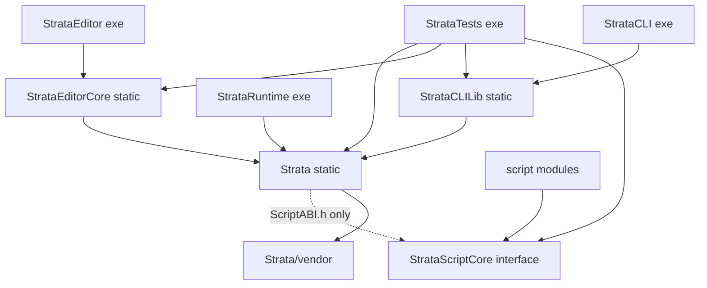

# Strata architecture

How the engine, the editor, the runtime and the tools fit together, for an engineer joining the project. Rules and
conventions (code style, testing, the review checklist) are in [AGENTS.md](../AGENTS.md) and are not repeated here;
task playbooks are the skills in [.claude/skills/](../.claude/skills/). Every section names the code it describes:
when that code changes, update this file in the same commit (AGENTS.md, review checklist item 5).

Paths are relative to the repository root. Engine modules live in `Strata/src/Strata/<Module>/`, so `Scene/Scene.h`
means `Strata/src/Strata/Scene/Scene.h`.

1. [Targets and dependencies](#targets-and-dependencies)
2. [Engine modules](#engine-modules)
3. [Application and frame loop](#application-and-frame-loop)
4. [Scene runtime lifecycle](#scene-runtime-lifecycle)
5. [Threading model](#threading-model)
6. [Asset pipeline](#asset-pipeline)
7. [Scripting](#scripting)
8. [Editor](#editor)
9. [Export and the runtime](#export-and-the-runtime)

## Targets and dependencies

The root `CMakeLists.txt` adds `Strata/vendor`, `StrataScriptCore` and `Strata`, then the optional targets
(`STRATA_BUILD_EDITOR`, `STRATA_BUILD_RUNTIME`, `STRATA_BUILD_CLI`, `STRATA_BUILD_TESTS`). An arrow means "links".



Each target is defined in the `CMakeLists.txt` of its directory; script modules by `strata_add_script_module()` in
`StrataScriptCore/CMake/StrataScriptModule.cmake`.

| Target | Kind | What it is |
| --- | --- | --- |
| `Strata` | static library | Engine modules, platform code, embedded shaders and default font (`Strata/src/`). |
| `StrataScriptCore` | interface library | Script C ABI and header-only C++ SDK; links glm only (`StrataScriptCore/`). |
| `StrataEditorCore` | static library | The editor without UI (`StrataEditor/src/Editor/`). |
| `StrataEditor` | executable | ImGui panels and `EditorLayer` on top of the core; links `nfd` (`StrataEditor/src/`). |
| `StrataRuntime` | executable | Plays exported games (`StrataRuntime/src/RuntimeApplication.cpp`). |
| `StrataCLILib`, `StrataCLI` | static library, executable | Automation client and MCP server (`StrataCLI/src/`). |
| `StrataTests` | executable | doctest suites; builds the test script modules as dependencies (`StrataTests/`). |
| script modules | `MODULE` libraries | Game code: the tests' modules and every game project's `Scripts/`. |

What may depend on what:

- `Strata` knows nothing about the editor, the runtime executable, the CLI or the tests. It links `StrataScriptCore`
  privately and only for `StrataScript/ScriptABI.h`; it never includes the C++ SDK (comment in
  `Strata/CMakeLists.txt`). Its public dependencies are glm, EnTT, spdlog, nlohmann_json, NVRHI, Dear ImGui and
  ImGuizmo; Vulkan, GLFW, Jolt, miniaudio, stb, cgltf, MikkTSpace and meshoptimizer are private, so dependents do not
  see their headers.
- Script modules link `StrataScriptCore` only and never the engine; only two entry points are exported
  (`StrataScriptModule.cmake`). See [Scripting](#scripting).
- `StrataEditorCore` holds everything testable about the editor; `StrataEditor/src/Panels/` and `UI/` only draw its
  state and call its commands. Tests link the core, never the panels.
- StrataCLI's logic lives in `StrataCLILib` so that `StrataTests` can link it (`STRATA_TESTS_HAVE_CLI`). Editor and
  CLI tests compile only when those targets exist (`StrataTests/CMakeLists.txt`).
- Platform code is in `Strata/src/Platform/` (`Windows`, `Posix`, `GLFW`, `Vulkan`), filtered per OS by
  `Strata/CMakeLists.txt`; engine modules reach it through interfaces such as `Core/Platform.h`, `Core/Window.h`,
  `Core/CrashGuard.h`, `Core/Process.h`, `Core/DynamicLibrary.h`, `Core/FileChangeNotifier.h` and
  `Renderer/GraphicsDevice.h`. Engine code outside `src/Platform/` includes no OS headers.

Applications built on `Application` (editor, runtime) get `main` from `Core/EntryPoint.h`, which calls the client's
`CreateApplication`, runs it and returns its exit code. `StrataCLI` has its own `main` and no `Application`.

## Engine modules

**Core** (`Core/`). `Application` owns the window, the graphics device, the layer stack and the main-thread queue
and runs the frame loop; `Layer`/`LayerStack` hold the client's behavior; `Window` is implemented by
`Platform/GLFW/GLFWWindow`. Services: `Log` (spdlog; `LogBuffer` backs the editor console and `log.read`), `Assert`,
`JobSystem`, `FileSystem` (UTF-8 paths), `FileWatcher`, `FileLock`, `Platform` (OS services, private directories),
`Process` (child processes), `DynamicLibrary`, `CrashGuard`, `UUID`, `Crypto` (SHA-256, peer authentication), `Base64`,
`CommandLine`, `Timer`/`FramePacer`, `JsonUtils` (exception-free JSON reads), `SequenceLock` (lock-free hand-off to the
audio thread) and `Profiling` (Tracy with `STRATA_ENABLE_TRACY`).

**Events** (`Events/`). Window, key and mouse events (`ApplicationEvent.h`, `KeyEvent.h`, `MouseEvent.h`, including
`WindowFileDropEvent`) are dispatched synchronously: `Application::OnEvent` hands each one to the layers from the top
down until one marks it handled (`EventDispatcher`). An unhandled `WindowCloseEvent` ends the application, so a layer
can veto closing (the editor asks about unsaved changes).

**Input** (`Input/`). `Input` is a static polling API: down state, per-frame pressed/released transitions, mouse
position relative to the input viewport, deltas, scrolling and gamepads. `GLFWWindow` feeds it (`Input::Process*`).
It also has a virtual device for tools (`SimulateKey` and friends) merged with the real devices, `SetEnabled` (device
input off, e.g. while the editor's game view has no focus) and `SetSuspended` (input frames follow the game's
updates). `InputNames` maps key and button names for the `input.*` commands.

**Math** (`Math/`). Engine conventions in `Math.h`: right-handed, +Y up, -Z forward, reversed-Z projections, Euler
angles in degrees. `AABB`, `Frustum`, `Ray`, and `Random` (thread-local generators).

**Reflection** (`Reflection/`). `PropertyType` (Bool to Entity), `PropertyInfo` (ranges, enum options, flags),
`PropertyBuilder`, `ComponentRegistry` (`ComponentInfo`: metadata plus type-erased ECS operations; components are
registered while the composition root runs and the registry is frozen afterwards, see
[Composition root and registries](#composition-root-and-registries)) and `PropertyJson` (canonical JSON plus lenient
parsing for automation). Reflection is the single description of component data: `SceneSerializer`, the inspector
(`StrataEditor/src/UI/PropertyWidgets.h`), the `component.*` commands, undo snapshots and script property access all
go through it, mostly via `Scene/ComponentAccess`.

**Scene** (`Scene/`). `Scene` owns the EnTT registry, the UUID map, the hierarchy and the cached world transforms,
and while it runs its scene systems (see [Scene runtime lifecycle](#scene-runtime-lifecycle)). `Entity` is a
non-owning handle. Components are plain structs in `Components.h`, registered with stable names in
`ComponentRegistration.cpp` (ID, Name, Transform, Relationship, Tag, Inactive, PrefabInstance, Camera, MeshRenderer,
DirectionalLight, PointLight, SpotLight, SkyLight, PostProcess, Text, RigidBody, BoxCollider, SphereCollider,
CapsuleCollider, MeshCollider, AudioSource, AudioListener, Script). `ComponentAccess` reads and writes them with
validation and change signals, `SceneSerializer` writes versioned JSON (keeping components it cannot read, see
[Composition root and registries](#composition-root-and-registries)), and `Prefab.h` defines the scene-shaped assets
(`EntityTemplate`, `Prefab`, `Model`, `SceneAsset`). `Scene::UpdateWorldTransforms` runs every frame and splits large
scenes by root entity over `JobSystem::ParallelFor` (`Scene.cpp`).

**Asset** (`Asset/`). `AssetManagerBase` (registry and asynchronous loading), `AssetManager` (the process-wide active
manager), `EditorAssetManager` (project files, `.meta` sidecars, imports, hot reload, pack building),
`RuntimeAssetManager` (reads an `AssetPack`), `AssetImporter` with the built-in importers (`AssetImporters.cpp`,
`GltfImporter`, `TextureImporter`), `AssetLoaderRegistry` (the loaders, registered by the modules that own the types)
and `BuiltinAssets` (fixed handles; the owning module provides each object through a factory). The asset types are
Scene, Prefab, Model, Mesh, Material, Texture, AudioClip and Font (`AssetTypes.h`). See
[Asset pipeline](#asset-pipeline).

**Renderer** (`Renderer/`). `GraphicsDevice` is the device interface (NVRHI on Vulkan, implemented in
`Platform/Vulkan/VulkanGraphicsDevice.cpp`; it owns the swapchain and frames in flight, 2 by default). `Renderer`
holds the process-wide services: the device, `ShaderLibrary` (SPIR-V compiled from `Strata/shaders` by glslang at
build time and embedded, `CMake/StrataShaders.cmake`), samplers, fallback textures, `BindlessTextureTable` and the
blocking `ReadTexture`. `SceneRenderer` draws a scene (light clustering, shadow cascades, depth/normal/entity-ID
prepass, GTAO, forward PBR, sky, transparents, exposure, bloom, tone mapping, FXAA, then overlays and text). Assets:
`Mesh`, `Material`, `Texture`, `Font`; procedural primitives come from `MeshFactory`. Also `TextRenderer`/`FontAtlas`,
`DebugDraw`/`SceneGizmos`, `TextureReadback` (non-blocking GPU readback) and `ImageWriter` (PNG). Conventions and
rules: AGENTS.md, "Architecture rules" and "Rendering".

**Physics** (`Physics/`). `PhysicsSystem` is the "Physics" scene system (Play and Simulate). `PhysicsWorld` builds a
Jolt world from RigidBody and collider components and steps it; `PhysicsRuntime` reference-counts Jolt's global
state; `PhysicsJobSystem` runs Jolt's jobs on the engine's worker pool; `PhysicsMeshShapes` cooks mesh collider shapes
on jobs and caches them process-wide; `AssetMeshProvider` supplies mesh data from the active asset manager.
`PhysicsTypes.h` has the settings, layers, `CollisionEvent` and `RaycastHit`. Collision events collected during a step
are dispatched afterwards on the main thread to listeners (`PhysicsSystem::AddCollisionListener`).

**Audio** (`Audio/`). `AudioEngine` wraps the miniaudio mixer, output device, listener and one-shots (main-thread
API; mixing runs on miniaudio's audio thread, or is pulled with `AdvanceNullDevice`/`ReadFrames` without a device).
`AudioClip` is immutable sound data, decompressed or streamed; `AudioClipAsset` is its asset, `AudioSource` a voice
with settings, and `AudioSystem` the "Audio" scene system (Play only). Details: AGENTS.md, "Audio".

**Scripting** (`Scripting/`). `ScriptEngine` (the loaded module, hot reload, faults, optional watchdog),
`ScriptModule` (loading, validation and guarded calls), `ScriptSystem` (the "Scripting" scene system: instances and
callbacks), `ScriptHostAPI` (the host function table), `ScriptValue` (ABI value conversions), `ScriptTypes`
(class, field and fault descriptions) and `ScriptWatchdog`. See [Scripting](#scripting).

**Project** (`Project/`). `Project` is a game project: the `.stproj` file, the asset directory, the script sources and
the intermediate directory `.strata/` (`Cache/`, `Scripts/Build/`, `Scripts/Bin/`), plus the process-wide active
project. `GameManifest` is the `.stgame` file of an exported game (name, asset pack, start scene, script module,
window settings).

**Runtime** (`Runtime/`). `GameRuntime` runs an exported game without depending on windowing or rendering: it opens
the pack, loads the script module, starts scenes and honors their requests. `GameRenderer` draws the running scene
from its primary camera, or a message frame that names the problem. See
[Export and the runtime](#export-and-the-runtime).

**Network** (`Network/`). `TcpSocket`/`TcpListener`/`SocketPoller` (`Socket.h`, implemented in
`Platform/Windows/WindowsSocket.cpp` and `Platform/Posix/PosixSocket.cpp`), `JsonRpc` (newline-delimited JSON-RPC
2.0), `RpcServer` (network thread, `RpcAuthentication` handshake, handlers on the main thread), `RpcClient`
(synchronous) and `EditorSession` (session files and discovery). Used by editor automation and StrataCLI; the
runtime does not use it. Protocol and security model: AGENTS.md, "Automation (editor RPC + MCP)".

**ImGui** (`ImGui/`). `ImGuiLayer` owns the Dear ImGui context; `Application` pushes it as an overlay when ImGui is
enabled and a window and graphics device exist, and calls `Begin`/`End` around the layers' `OnImGuiRender`.
`ImGuiRenderer` is the NVRHI backend (user textures are `nvrhi::ITexture*`). Only the editor enables it.

**Engine** (`Engine/`). `BuiltinModules`, the composition root (below), and nothing else: the only code that knows every
module.

### Composition root and registries

The engine is extended through registries rather than through code that knows its modules: `ComponentRegistry`
(components), `AssetLoaderRegistry` (stored bytes to asset objects), `AssetImporterRegistry` (source files to stored
bytes), `BuiltinAssets` (objects of the built-in assets) and `SceneSystemRegistry` (runtime systems of playing scenes).
`Engine::RegisterBuiltinModules` (`Engine/BuiltinModules.cpp`) fills them, once per process, before anything reads
them:

```text
open every registry (BeginRegistration)
RegisterSceneModule        Scene/SceneRegistration.cpp         components (ComponentRegistration.cpp); Scene, Prefab, Model loaders
RegisterRendererModule     Renderer/RendererRegistration.cpp   Texture, Mesh, Material, Font loaders; built-in meshes and material
RegisterScriptingModule    Scripting/ScriptingRegistration.cpp "Scripting" system
RegisterPhysicsModule      Physics/PhysicsRegistration.cpp     "Physics" system
RegisterAudioModule        Audio/AudioRegistration.cpp         AudioClip loader, "Audio" system
RegisterAssetPipeline      Asset/AssetImporters.cpp            importers (ModuleRegistrationOptions::AssetPipeline)
options.Extra              registrations of games, tools and tests
ComponentRegistry::Freeze
```

- **Callers.** The `Application` constructor calls it first thing, so the editor and the runtime are covered; a client
  that needs options calls it earlier (StrataRuntime, in `CreateApplication`, runs without the asset pipeline: games
  read cooked packs). `StrataTests` calls it in `main` before doctest runs and in its helper modes. A second call is a
  no-op (with an error when it carries `Extra` registrations, which would be lost).
- **Use before registration** fails `ST_CORE_VERIFY` with a message naming `Engine::RegisterBuiltinModules`, in every
  registry: a program that forgot the composition root stops at its first lookup instead of running without
  components or loaders.
- **Component lifecycle.** `ComponentRegistry` is closed, then open (`BeginRegistration`: `Register<T>` is valid from
  any registering code), then frozen (`Freeze`): the set of components never changes afterwards, so reads take no lock
  and are safe from any thread (asset loads deserialize scenes on workers). `Register<T>` after `Freeze`, for a type
  that is registered already or under a name that is taken (ignoring case), logs an error and returns a builder that
  converts to false and discards what it is given; nothing aborts. A game registers its components through
  `ModuleRegistrationOptions::Extra`.
- The loader, importer, built-in asset and scene system registries stay open: tools and tests register more later
  (a later loader or importer replaces or overrides the built-in one).
- **Components of modules a build lacks survive.** A scene, prefab or snapshot can name components this build does
  not register (a game module that is not loaded, a newer engine). `SceneSerializer::DeserializeEntities` keeps them
  verbatim in the runtime-only `UnknownComponentsComponent` (`Scene/UnknownComponents.h`; not registered, so the
  editor, reflection and the feature test never see it) and warns once per component name per load
  (`SceneAsset::CreateScene` logs its warnings); the writer puts them back next to the registered components, so a save
  writes them unchanged. `Scene::Copy` (play mode), prefab snapshots (`SerializeEntities`), `Scene::DuplicateEntity`
  and the editor's undo snapshots (`EntityState`, `Editor/SceneEdit.cpp`) carry them; restoring undo snapshots does not
  warn again (`EntityInstantiationOptions::ReportUnknownComponents`).

## Application and frame loop

Startup (`Application::Application`, `Core/Application.cpp`): `Engine::RegisterBuiltinModules` (a no-op when the client
registered the modules already), set the working directory, `JobSystem::Init`, create
the window unless headless, `Input::Reset`, create the graphics device, swapchain and `Renderer` when
`EnableRenderer` is set (no usable device: exit code 1), `AudioEngine::Init` (the null device when headless), and push
the `ImGuiLayer` overlay. The client's constructor then pushes its layer (`EditorLayer`, `RuntimeLayer`).

One frame (`Application::Run` and `RunFrame`):

```text
 1  ExecuteMainThreadQueue           functions queued with Application::SubmitToMainThread
 2  Input::BeginFrame                new input frame; queued simulated input applies
 3  Window::ProcessEvents            glfwPollEvents: Input::Process*, events through the layers
                                     window minimized: sleep 16 ms, frame skipped (not counted)
 4  GraphicsDevice::BeginFrame       cannot begin (e.g. mid-resize): sleep 16 ms, skipped; device lost: close
    Renderer::BeginFrame
 5  Layer::OnUpdate(timestep)        every layer in stack order: the editor's or the game's work, below
 6  AudioEngine::AdvanceNullDevice   only while mixing without an output device
    AudioEngine::Update              reclaims finished one-shots
 7  RenderImGui                      ImGuiLayer::Begin, every Layer::OnImGuiRender, ImGuiLayer::End
 8  back-buffer captures, GraphicsDevice::EndFrame (present)
    frame counted; MaxFrames (--frames) closes the application; FramePacer::WaitForNextFrame
```

The timestep is the wall time since the previous frame, clamped to `ApplicationSpecification::MaxTimestep` (0.25 s).
Windowed applications are paced by vsync when it is on (`WindowSpecification::VSync`); headless ones by
`MaxFrameRate`, which the editor and the runtime set to 60 (`StrataEditor/src/EditorApplication.cpp`,
`RuntimeApplication.cpp`). An exception escaping a frame (e.g. a lost device inside NVRHI) is logged and ends the
loop.

The editor's layer update (`EditorLayer::OnUpdate`, `StrataEditor/src/EditorLayer.cpp`):

1. `EditorContext::Update`: `ScriptEngine::Update` (hot reload), `ScriptBuilder::Update` (build processes),
   `EditorAssetManager::Update` (file changes, finished imports, load finalization), then either the running scene's
   `OnUpdateRuntime` followed by the script-fault check and the game's quit and scene-load requests, or the edited
   scene's `OnUpdateEditor`; then simulated input holds, input suspension, selection pruning and viewport picks.
2. `EditorCommandRunner::Update`: polls deferred commands.
3. `EditorAutomation::Update`: mirrors new commands as RPC methods, moves the session file with the project, and runs
   queued requests (`RpcServer::ProcessRequests`) through the runner.
4. The `--commands` script advances; quit, idle-timeout and last-frame checks run.

In step 7 the editor draws its panels (`EditorLayer::OnImGuiRender`); the viewport panel renders the scene there
through `ViewportRenderer`.

The runtime's layer update (`RuntimeLayer::OnUpdate`, `StrataRuntime/src/RuntimeApplication.cpp`):
`GameRuntime::Update` (asset finalization, `Scene::OnUpdateRuntime`, script-fault check, scene requests), then the
headless script-crash and quit checks, then `GameRenderer::Render` into the back buffer (windowed only) and the
`--screenshot` request on the last frame. The runtime has no ImGui.

Shutdown (`Application::~Application`): layers detach and are deleted top-down, the active asset manager and project
are released, the main-thread queue drains, `JobSystem::Shutdown` runs the queued jobs and joins the threads, then
audio, the renderer, the device and the window go.

## Scene runtime lifecycle

A `Scene` that plays owns scene systems (`Scene/SceneSystem.h`), created from `SceneSystemRegistry` in update order.
The built-ins (registered by their modules, see [Composition root and registries](#composition-root-and-registries))
are, in update order:

| System | Class | Modes | Order | Role |
| --- | --- | --- | --- | --- |
| Scripting | `ScriptSystem` | Play | | Script instances of the active `ScriptEngine` (null engine: no scripts). |
| Physics | `PhysicsSystem` | Play, Simulate | After Scripting | Jolt world; steps in `OnFixedUpdate`, then dispatches contacts. |
| Audio | `AudioSystem` | Play | After Physics | Sources and listener, in `OnLateUpdate` after scripts and physics. |

- **Update order.** A `SceneSystemDescriptor` names the systems it runs `After` and `Before`. The registry keeps a
  stable topological order of these constraints, in which registration order decides between systems that are not
  constrained against each other, and recomputes it on every `Register` and `Unregister` (`Scene/SceneSystem.cpp`).
  A constraint that names an unregistered system or the system itself, or that closes a cycle, makes `Register` return
  false with an error naming the systems (e.g. `TestA -> TestB -> TestA`) and leaves the registry unchanged; so does
  unregistering a system others name. Changes are refused while any scene runs (`Scene::GetRunningSceneCount`): the
  running scenes created their systems from the registry.
- **Lookup.** `MakeSceneSystemDescriptor<T>` records the class (`SceneSystemDescriptor::Type`); `OnRuntimeStart` maps
  it to the created system, so `Scene::GetSystem<T>` is a hash lookup of the exact class (null for a class that is not
  registered, not created in the current mode, or a base class).

```text
OnRuntimeStart(mode)   reset time, pause, steps and requests; create the systems the mode runs;
                       every OnRuntimeStart, then every OnRuntimeStarted (scripts' OnCreate: physics already runs)
OnUpdateRuntime(dt)    paused without steps: only world transforms
                       dt = timestep * time scale (one fixed step while stepping)
                       OnUpdate -> OnFixedUpdate x N (accumulator, at most MaxFixedStepsPerFrame = 8, backlog
                       dropped) -> OnLateUpdate -> flush deferred destruction -> world transforms
SetPaused(bool)        OnPausedChanged on every system; Step(n) runs n single fixed steps while paused
OnRuntimeStop()        OnRuntimeStop in reverse order, systems destroyed in reverse order, destruction flushed
```

- While systems run (`Scene::IsUpdating`), `DestroyEntity` is deferred to the end of the update; before an entity
  goes, every system gets `OnEntityDestroying` (descendants first), so scripts receive `OnDestroy` with the entity
  still valid (`Scene.cpp`).
- Systems react to edits through EnTT signals; `ComponentAccess` and `Entity::MarkModified` emit `on_update`.
- Gameplay asks the scene's owner to quit or to switch scenes (`Scene::RequestQuit`, `RequestSceneLoad`); owners honor
  the requests after the update. The owners are the editor's play mode (`EditorContext::StartRuntime` plays a
  `Scene::Copy` of the edited scene; `Stop` discards it) and `GameRuntime`.
- `SceneSettings` holds gravity, the fixed timestep (1/60 s) and `MaxFixedStepsPerFrame`.

## Threading model

The main thread owns the scene, input, scripts, editor state and rendering submission (AGENTS.md, "Architecture
rules"). Other threads:

- **Job workers** (`JobSystem::Init`, `Core/JobSystem.cpp`; hardware threads - 1 by default): `JobSystem::Submit` and
  `ParallelFor` work such as asset decoding, the initial imports of a project scan, Jolt's jobs, mesh shape cooking,
  world transform propagation and PNG encoding of captures.
- **I/O threads** (`JobSystem::Init`; 2 by default): `JobSystem::SubmitIO` work such as asset reads, background
  re-imports and saving captures.
- **File watchers** (`FileWatcher::Start`): one thread per watcher, for the project's asset directory
  (`EditorAssetManager`) and for the script module's directory (`ScriptEngine`, hot reload). Each rescans its tree when
  the platform reports a change (`FileChangeNotifier`: change notifications on Windows,
  `Platform/Windows/WindowsFileChangeNotifier.cpp`) or its poll interval has passed (Linux and macOS only poll).
- **Audio** (miniaudio): mixes for the output device. The `AudioEngine` API stays on the main thread; the listener's up
  vector reaches the mixer through a `SequenceLock` (`Audio/AudioEngine.cpp`).
- **RPC network** (`RpcServer::Start`): all socket I/O of editor automation and the built-in `rpc.*` methods.
- **Script watchdog** (`ScriptEngine::SetWatchdogTimeout`): off unless a timeout is set; only logs long script calls.
- **Process output readers** (`Core/Process.h`): read a child's output pipes (script builds).
- **MCP input** (`StrataCLI/src/CLI/McpServer.cpp`, in the StrataCLI process): reads stdin lines into a queue.

Jobs submitted before `JobSystem::Init` or after `Shutdown` run inline; waiting threads help run queued CPU jobs, so
waiting inside a job cannot deadlock (`Core/JobSystem.h`). Jolt's step is called on the main thread and its jobs run on
the worker pool, with the stepping thread running them itself when the workers are busy
(`Physics/PhysicsJobSystem.cpp`).

Results come back to the main thread by polling, never through callbacks into engine state from other threads:

| Producer | Hand-off | Consumed by (main thread) |
| --- | --- | --- |
| Asset load jobs | completion queue (`AssetManagerBase::PushCompletion`) | `AssetManagerBase::Update` |
| Background imports | `m_CompletedImports` | `EditorAssetManager::Update` |
| File watchers | change queue | `FileWatcher::PollChanges` in `EditorAssetManager::Update`, `ScriptEngine::Update` |
| RPC network thread | request queue | `RpcServer::ProcessRequests` from `EditorAutomation::Update` |
| Job-based commands | `JobHandle` | deferred command polls, e.g. `viewport.capture` (`EditorViewportCommands.cpp`) |
| Child processes | captured output | `ScriptBuilder::Update` |
| Any thread | `Application::SubmitToMainThread` | start of the next frame |

`RpcResponder::Respond` is thread-safe, so an answer may be produced on any thread; in the editor, answers are given by
the runner's completions on the main thread.

## Asset pipeline

Rules (handles in `.meta`, the cache, importer version bumps, `ReadImportDependency`, sub-asset and built-in
handles) are in AGENTS.md, "Asset pipeline". The data flow:

```text
 Editor                                                          Shipped game
 Assets/<file> + <file>.meta (handle, import settings)
   | EditorAssetManager::Scan, FileWatcher
   v
 AssetImporter (by extension) -- ReadImportDependency --> other files under Assets/
   | stored bytes; sub-assets with DeriveSubAssetHandle
   v
 .strata/Cache/<handle>.bin + <handle>.import  -- BuildAssetPack -->  <Game>.stpak
 (JSON assets and fonts: the source file itself)                         | RuntimeAssetManager
   |                                                                     |
   +-------------------------- ReadAssetData (I/O thread) ---------------+
                                     v
 AssetManagerBase: I/O read -> worker decode (AssetLoadFunction) -> completion queue
                                     v
 AssetManagerBase::Update (main thread): FinalizeOnMainThread (GPU uploads) within the upload budget -> Ready
```

- **Importing** (`Asset/EditorAssetManager.h`). `Scan` registers every file with a known importer, creates missing
  `.meta` files and imports stale assets in parallel (`JobSystem::ParallelFor`), blocking. Afterwards the file watcher
  reports changes; `Update` re-registers files and queues re-imports on the I/O pool, and applies finished imports by
  reloading loaded assets (`ReloadAsset`). The cache record (`<handle>.import`) remembers the source state, settings,
  importer version and dependencies, so a current import is reused.
- **Importers and stored forms** (`Asset/AssetImporters.cpp`; the loaders that read the stored form are registered by
  the module that owns each type, one `Deserialize` per type, `Font::Create` for fonts):

  | Type | Sources | Importer | Stored form |
  | --- | --- | --- | --- |
  | Scene, Prefab, Material | `.stscene .stprefab .stmat` | `NativeAssetImporter` | the JSON source |
  | Texture | `.png .jpg .jpeg .tga .bmp .psd .gif .hdr` | `TextureImporter` | cooked `STTX` texture |
  | Model | `.gltf .glb` | `GltfImporter` | entity template; Mesh, Material, Texture sub-assets |
  | AudioClip | `.wav .mp3 .flac .ogg` | `AudioClipImporter` | `STAU` header + the encoded file |
  | Font | `.ttf .otf` | `FontImporter` | the source, validated on import |

- **Loading** (`Asset/AssetManager.h`). `GetAsset` never blocks: it returns null until the asset is Ready and requests
  the load. `RequestLoad` reads on the I/O pool (`ReadAssetData` of the subclass), decodes on the worker pool and
  queues a completion. `Update` finalizes completions on the main thread: `Asset::FinalizeOnMainThread` creates GPU
  resources on one upload command list until `GetMemoryUsage` of the finalized assets reaches the upload budget
  (256 MiB per frame by default, `SetUploadBudget`); the rest waits for the next frame. Generations discard results of
  loads that were superseded by a reload or unload. `LoadAssetSync` is for tools, tests and scene switches.
- **Streaming**. Assets load on first use and code handles "not loaded yet" every frame: `SceneRenderer` skips or
  substitutes what is pending and counts it (`SceneRendererStats::PendingAssets`), `AssetMeshProvider` reports meshes
  as unavailable until they load, and audio sources start when their clip is ready. The content version and change
  list (`GetContentVersion`, `GetContentChanges`) let caches revalidate only what changed.
- **Built-in assets** (`Asset/BuiltinAssets.h`) are memory assets with handles 1 to 255, registered by every
  `AssetManagerBase`. Without a project the editor keeps a manager with only these active.
- **Packs** (`Asset/AssetPack.h`). `EditorAssetManager::BuildAssetPack` writes every project asset in its stored form
  (it fails if an import failed): a header, the data blobs, then the entry table, written atomically.
  `RuntimeAssetManager` registers the entries and reads blobs on the I/O pool; nothing is imported at runtime.

## Scripting

Rules for the ABI, host functions and the SDK are in AGENTS.md, "Scripting"; writing scripts is the
`strata-scripting` skill. The layers:

```text
 game code (Script subclasses)    StrataScriptCore/Include/StrataScript/*.h   C++ SDK, header-only
 module entry points              StrataScriptCore/Source/ScriptModuleEntry.cpp
 ----------------------------- C ABI: StrataScript/ScriptABI.h --------------------------------------------
 ScriptModule        library loading, validation, CrashGuard around every call       Scripting/ScriptModule.h
 ScriptEngine        the loaded module, hot reload, faults, active engine            Scripting/ScriptEngine.h
 ScriptSystem        instances and callbacks of one playing scene                     Scripting/ScriptSystem.h
 ScriptHostAPI       StrataScriptHostAPI table: engine services for scripts           Scripting/ScriptHostAPI.cpp
```

- **ABI**. A module exports `StrataScript_GetABIVersion` and `StrataScript_Load`. The engine refuses a version other
  than `ST_SCRIPT_ABI_VERSION`, then calls `StrataScript_Load` with the host table and a `StrataScriptModuleAPI` whose
  `StructSize` bounds what the module may write. The module describes its classes (`StrataScriptClassDesc`: create,
  destroy, field access, callbacks) and fields; only plain C data crosses the boundary.
- **Loading** (`ScriptModule::Load`). The library loads in place or from a private copy (`ScriptModuleLoadMode`);
  copies live in a per-process directory under `Platform::GetUserRuntimeDirectory`. A file that is already loaded is
  always loaded from a copy. The ABI version query, `StrataScript_Load` and reading the description all run guarded;
  the description is validated before the module is used.
- **Active engine**. Scenes use the engine that is active when they start (`ScriptEngine::SetActive`). The editor
  owns one per open project (`EditorContext::OpenScriptEngine`) and activates it again on `Play`; `GameRuntime` owns
  the game's.
- **Instances** (`ScriptSystem`). One instance per Script component entry, constructed with its field overrides;
  `OnCreate` runs at the next sync point (in `OnRuntimeStarted` for the initial set). Updates follow hierarchy order,
  then entry order. Contacts come from the `PhysicsSystem` collision listener. Entity destruction requested by scripts
  waits until the scene can do it safely (`ScriptSystem::DestroyEntity`), and removed instances are destroyed at the
  next sync point.
- **Host functions** (`ScriptHostAPI.cpp`). Every function runs in `HostCall` (no exception unwinds into the module)
  and starts with `ResolveContext`, which rejects calls from other threads, outside callbacks or from a crashed module.
  The table is built from `ST_SCRIPT_HOST_FUNCTIONS`, which counts calls for the feature test.
- **Crash guard** (`Core/CrashGuard.h`). Windows: structured exception handling around the call
  (`Platform/Windows/WindowsCrashGuard.cpp`, `__try`/`__except`, with `_resetstkoflw` after a stack overflow); SDK
  modules turn `abort()` into a structured exception from a SIGABRT handler in their static C runtime. POSIX: handlers
  for SIGSEGV, SIGBUS, SIGFPE, SIGILL and SIGTRAP on an alternate signal stack, leaving through `siglongjmp` (Linux) or
  by returning into a recovery routine (macOS); SIGABRT is reported, not contained
  (`Platform/Posix/PosixCrashGuard.cpp`). What is and is not contained is listed in `Scripting/ScriptEngine.h`.
- **Faults**. An exception thrown by a script is caught by the SDK and disables only that instance. A crash faults the
  whole module: it is never called again, its instances are abandoned, and `ScriptEngine::IsFaulted`/`GetFault` report
  it. The editor stops play mode and refuses `play.start` until the module is rebuilt or reloaded; `GameRuntime`
  disables the scripts for the session.
- **Hot reload** (`ScriptEngine::Update`). With hot reload enabled the engine watches the module's directory (300 ms
  debounce, so the linker has finished) and reloads between frames, never while script code is on the stack; failed
  reloads of a file that is still busy are retried. Running systems snapshot fields (`BeginModuleReload`), the new
  module replaces the old one, and instances are recreated with their fields and get `OnReload`
  (`EndModuleReload`). A load that fails keeps the running module.
- **Watchdog** (`ScriptWatchdog`). Native code cannot be interrupted; with a timeout set the watchdog thread only
  logs calls that run too long.

## Editor

```text
 StrataEditor      EditorApplication -> EditorLayer (owns everything below): panels (Viewport, Hierarchy,
                   Inspector, ContentBrowser, Console), toolbar, shortcuts, file dialogs (nfd)
 --------------------------------------------------------------------------------------------------------------
 StrataEditorCore  EditorContext          project, EditorAssetManager, edited and running scene, play mode,
                                          selection, UndoStack, ScriptEngine + ScriptBuilder, EditorViewport,
                                          SimulatedInput
                   EditorCommandRegistry  every operation as a named command with a JSON Schema
                   EditorCommandRunner    deferred commands; EditorCommandScript runs --commands files
                   EditorAutomation       RpcServer exposing the commands; session files
```

- **EditorContext** (`StrataEditor/src/Editor/EditorContext.h`) is the state with no UI. Opening a project creates and
  activates its `EditorAssetManager` (scan included), opens a `ScriptEngine` (hot reload on by default,
  `EditorContextSpecification::HotReloadScripts`) and loads the built module, restores the viewport state and opens
  the start scene. `GetActiveScene` is the running copy while playing, else the edited scene.
- **Commands** (`EditorCommands.h`). Handlers take a JSON object and return an `EditorCommandResult`: a value, an error
  with an `EditorCommandError` kind, or `Defer(poll)`. The built-in groups are registered by
  `EditorSceneCommands.cpp` (scene, entity, component, prefab), `EditorAssetCommands.cpp` (asset, material, prefab,
  project), `EditorStateCommands.cpp` (edit, editor, log, play, selection), `EditorViewportCommands.cpp` (camera,
  viewport), `EditorScriptCommands.cpp` (script), `EditorInputCommands.cpp` (input) and `EditorCommands.cpp`
  (`editor.commands`). Conventions: AGENTS.md, "Editor".
- **Runner** (`EditorCommandRunner.h`). `Run` executes a command; a deferred one is polled once per frame from the next
  frame on, in issue order, and reports through its completion callback. Automation and command scripts always use the
  runner. UI actions that finish at once call the registry through `RunEditorCommand`
  (`Panels/SceneHierarchyPanel.cpp`), which rejects pending results; Build Scripts uses the runner (`EditorLayer.cpp`).
- **Undo** (`SceneEdit.h`, `UndoStack.h`). A `SceneEditTransaction` snapshots the entities an edit touches as
  `EntityState` (components as JSON, parent, sibling index); `Commit` records a `SceneEditAction` holding the states
  before and after, and undo or redo re-applies them with the same UUIDs (`SceneEdit::ApplyEntities`). Continuous edits
  merge by key; the stack keeps 512 steps and a save point for the modified flag. Edits while playing are not recorded.
- **Automation** (`EditorAutomation.h`, `Network/RpcServer.h`). The server's network thread does the socket work;
  each frame `EditorAutomation::Update` registers new or changed commands as methods and runs queued requests through
  the runner, so a deferred command answers when it completes. Clients find the editor through session files
  (`Network/EditorSession.h`). StrataCLI (`StrataCLI/src/CLI/`) connects with `RpcClient` (`EditorConnection`),
  starts editors (`EditorLauncher`) and serves MCP (`McpServer`, one tool per command).
- **Viewport** (`EditorViewport.h`, `ViewportRenderer.h`). `EditorViewport` holds the editor camera, the settings and
  two `ViewportRenderer`s (panel and captures). The panel renders during `OnImGuiRender`; `ResolveViewportView` picks
  the scene's primary camera while playing and the editor camera otherwise. Picking reads one pixel of the entity-ID
  buffer asynchronously and completes in `EditorContext::Update`. `viewport.capture` renders on the next frame, polls a
  `TextureReadback`, encodes the PNG on a worker and saves on an I/O thread (`EditorViewportCommands.cpp`).
- **Script builds** (`ScriptBuild.h`). `ScriptBuilder` runs CMake configure and build as child processes (one build at
  a time, ended as a process tree when cancelled), polled once per frame; its output streams to the log and is parsed
  into diagnostics. When a build finishes, `EditorContext` loads or hot reloads the module.

## Export and the runtime

`project.export` (`StrataEditor/src/Editor/GameExport.cpp`) requires a saved, stopped scene, an absolute output
directory outside the project, a start scene (or the open scene) and no running script build; a loaded script module
must still be the file that was loaded, and scenes or prefabs that use scripts need one. It writes:

| File | Source |
| --- | --- |
| `<Game>.stpak` | `EditorAssetManager::BuildAssetPack`: every project asset |
| script module (and its PDB) | `EditorContext::ReadRunningScriptModule`: the loaded module, checked by digest |
| `<Game>.stgame` | `GameManifest`: name, pack, start scene, module, window settings |
| `<Game>[.exe]`, `ThirdPartyNotices.md` | `StrataRuntime` from the editor's directory, renamed (`includeRuntime`) |

The module's PDB is copied when it exists, except in Dist builds or with `includeScriptSymbols: false`
(`GameExportOptions::IncludeScriptSymbols`).

`StrataRuntime` (`StrataRuntime/src/RuntimeApplication.cpp`) runs `--game <file>`, or the manifest found next to the
executable (`GameManifest::FindForExecutable`). It logs to `<user data>/<Game>/Logs/Game.log`. `--headless` disables
the window and the renderer and paces at 60 frames per second; `--windowed` overrides a fullscreen manifest, and
`--frames N` with `--screenshot out.png` saves the last frame. `GameRuntime::Create` loads the manifest, makes a
`RuntimeAssetManager` on the pack active, loads the script module into its own `ScriptEngine` without hot reload and
makes it active, and starts the start scene in Play mode.
Each frame it finalizes loads, updates the scene and honors requests: a quit ends the process with the game's exit
code, a scene load replaces the scene synchronously from the pack. Exit codes: 1 when the game cannot start, 2 when
the scripts crashed in a headless run (a windowed game keeps running without scripts), otherwise the code the game
quit with. Exported games are the end-to-end check of the whole pipeline: the CTest export chain
(`StrataEditor.Export`, `StrataRuntime.Smoke`, ...) is listed in the `strata-build-test` skill, the feature test
runners in AGENTS.md, "Testing".
